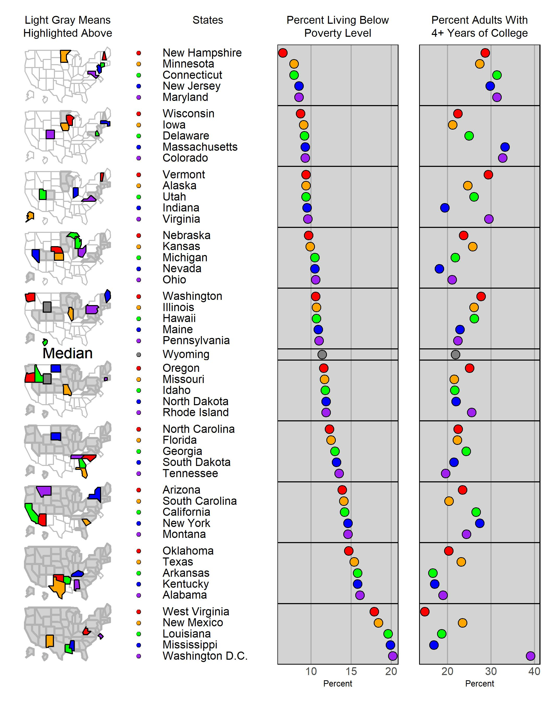

\mainmatter


# An Introduction to Micromaps {#Ch1}


\chapterauthor{J{\"u}rgen Symanzik}


Welcome to the _Micromap Plots in R Book_. In this chapter, we provide a general
overview of micromap visualizations. We present the three major classes of micromaps
and we introduce the nomenclature used throughout the book.
For each of the three major classes of micromaps,
we look at the historical developments, their design, features, and interpretation, and
the primary software and online developments for their construction. 
Also provided are an outlook on the remaining
chapters of this book and how to best use the accompanying R code,
webpage, and newly developed **micromapExtra**\index{R Packages!micromapExtra} R package.


## Introduction {#Ch1-Introduction}


Micromap visualizations\index{Micromap visualizations} are an important tool
for the visualization of statistical data in a geographic context,
providing a rich context for interpretation.
Micromap visualizations\index{Micromap visualizations} consist of a series of small maps, the _micromaps_,
that are used to show spatial patterns. These maps are also used
to link to underlying statistical data. 
There exist three major classes of micromaps, i.e.,
linked micromap plots,\index{Linked micromap plot}
introduced in Section \@ref(Ch1-LinkedMicromapPlots),
conditioned micromaps,\index{Conditioned micromaps}
introduced in Section \@ref(Ch1-ConditionedMicromaps), and
comparative micromaps,\index{Comparative micromaps}
introduced in Section \@ref(Ch1-ComparativeMicromaps).
In each of these three sections, we will first look at the 
historical development of that class of micromaps, 
then discuss their design, features, and interpretation,
and finish with an overview of past and current software and online developments.

Our nomenclature will closely follow the one from @SCMW2017.
Alternatives can sometimes be found elsewhere in the literature,
but it should be easy to match alternative terms with the terminology used in this book.
As an example, linked micromap plots\index{Linked micromap plot}
were originally called _map row plots_ (@OCCP1996). They often have been abbreviated as _LMplots_.
Conditioned micromaps\index{Conditioned micromaps} initially have been
called _conditioned choropleth maps_ (@CWC2000) and have been abbreviated as _CCmaps_.

What follows in Section \@ref(Ch1-Outlook)
is an outlook on the 14 chapters in this book.
Finally, Section \@ref(Ch1-HowToUse) will provide
some recommendations how to best use this book and
the accompanying R code, webpage, and the newly developed
**micromapExtra**\index{R Packages!micromapExtra} R package.


## Linked Micromap Plots {#Ch1-LinkedMicromapPlots}


### Historical Development {#Ch1-LinkedMicromapPlotsHistoricalDevelopment}


Linked micromap plots\index{Linked micromap plot} were introduced as the first
of the three major classes of micromap visualizations.\index{Micromap visualizations} 
They were originally presented at the Joint Statistical Meetings (JSM) 
in Chicago, Illinois, in 1996 [@OCCP1996].
A series of applications was published soon thereafter,
dealing with unemployment data of the United States and Washington, D.C. [@CaPi1996],
carbon dioxide (CO~2~) emissions in the
Organization for Economic Co-operation and Development (OECD) countries
and wheat price and labor force statistics in the United States and Washington, D.C. [@COCPC1998],
and of various climate variables in Omernik ecoregions 
(that were named after James M. Omernik) [@COPC1998;@COPC2000].

The early linked micromap plots\index{Linked micromap plot} development was
based on ideas from several other visualization developments of the 1980s and 1990s. In particular,
their development was heavily inspired by concepts developed for the conversion of 
statistical tables into graphical displays [@Carr1994a;@CN95],
the small multiples principle that was made widely popular by Edward R. Tufte [@Tu83;@Tu90;@Tu97],
as well as early map caricatures, such as Mark S. Monmonier's state visibilty map [@Mon93].

Linked micromap plots\index{Linked micromap plot} quickly gained popularity
among researchers at United States (U.S.) Federal Agencies such as
the U.S. Department of Agriculture – National Agricultural Statistics Service (USDA–NASS),
various branches of the U.S. Environmental Protection Agency (USEPA),
the National Cancer Institute (NCI),
the U.S. Census Bureau, and
the U.S. Bureau of Labor Statistics (BLS).
In addition to static linked micromap plots,\index{Linked micromap plot}
some of these agencies (in particular the NCI, the USEPA, and the USADA-NASS) developed early
interactive and web-based versions of linked micromap plots\index{Linked micromap plot}
as discussed in more detail in @SC2008.

As indicated in @OCCP1996, linked micromap plots\index{Linked micromap plot}
"give equal consideration to presenting data in attribute [i.e., statistical] space and
in geographic space." In contrast, traditionally used choropleth maps\index{Choropleth map} emphasize
the map visualization and put less emphasis on the visualization of the statistical data.
According to @PoLa2018, a choropleth map\index{Choropleth map} 
is a "map in which regions with differing occurrence rates 
of conditions of interest (e.g., cancer) are visually distinguished by different color or shading 
corresponding to rates at which the designated conditions have occurred in each region during the 
period of observation."

@SC2008 pointed out three main advantages of 
linked micromap plots\index{Linked micromap plot} over
choropleth maps.\index{Choropleth map}
First, small map regions (such as Washington, D.C., in a map of the 
United States) may be hard to see in a choropleth map.\index{Choropleth map}
In linked micromap plots,\index{Linked micromap plot} small map regions
are often enlarged and sometimes also pulled to the outside of the main map area, 
resulting in some kind of a map caricature that helps to make the smaller
map regions better visible.
Further changes of the underlying maps often take place, such as moving
far-away subregions closer to the main geographic region (such as Alaska and Hawaii
for the United States)
and simplifying the boundaries of the subregions (think of river boundaries or rugged coastlines)
for faster plotting
and obtaining a less dominant, i.e., thinner, borderline.

Second, when converting data from an ordered statistical variable into five to eight
discrete colors for coloring the map area in a choropleth map,\index{Choropleth map}
there is an immediate loss of information.
The exact numerical values of the variable are lost, the ranking of the values is lost,
and the relative proximities of the values that are translated into a certain color class 
that represents an interval of values is lost. This problem is solved by
using row-labeled statistical displays such as dotplots\index{Dotplot}
that are linked to the mircomaps in linked micromap plots,\index{Linked micromap plot}
rather than showing the statistical data directly on the map via a small
set of discrete colors.

Third, it is difficult to show more than one statistical variable directly
on a map. This becomes even more difficult when trying to display confidence
bounds or the minimum, first quartile, median, third quartile, and maximum
that make up the summary statistics that are visually displayed in a boxplot.\index{Boxplot}
This problem is resolved in linked micromap plots\index{Linked micromap plot}
by linking the statistical graphic displays to certain spatial areas,
rather than displaying the statistical information directly on a map.
Also, multiple types of statistical graphic displays can be shown simultaneously
in a linked micromap plot.\index{Linked micromap plot}

Readers who are interested to learn more about the background and history
of linked micromap plots\index{Linked micromap plot} are encouraged
to read the book chapters and encyclopedia entries by 
@SC2008 and @SCMW2017. Even more, 
for readers who want to learn the full background behind all three main types
of micromap visualizations,\index{Micromap visualizations}
we strongly recommend to read the excellent book by @CP2010.


### Design, Features, and Interpretation {#Ch1-LinkedMicromapPlotsDesignFeaturesInterpretation}


We will use three mock-up linked micromap plots\index{Linked micromap plot},
shown in Figures \@ref(fig:Ch1-NJ-Layout1), \@ref(fig:Ch1-NJ-Layout2), and \@ref(fig:Ch1-NJ-Layout3)
to introduce the main nomenclature for linked micromap plots\index{Linked micromap plot}
and how to interpret such plots. These three figures are based
on actual boundaries for New Jersey in the United States, obtained from
@USCensus2013Shapefiles. The statistical data are entirely made up for demonstration purposes.
In particular, the values for `StatVar4`, one of the four statistical variables, 
originate from a Normal distribution with 
mean 55 and standard deviation 10 and have been randomly assigned
to the 21 counties in New Jersey.


```{r Ch1-NJ-Layout1, fig.cap = 'Mock-up linked micromap plot\\index{Linked micromap plot}, based on the 21 counties of New Jersey. `StatVar1` is used as the sorting variable.', fig.width = 7, fig.height = 6, echo = FALSE}
library(micromap)
library(raster)

nj_shapefile <- raster::shapefile(
  x = "data/NJ_Shapefiles/co34_d00.shp",
  verbose = FALSE
)

# add missing CRS
proj4string(nj_shapefile) <- sp::CRS(projargs = "+init=epsg:4326")

# thin shapefile
nj_shapefile_thin <- maptools::thinnedSpatialPoly(
  SP = nj_shapefile,
  tolerance = 0.005,
  minarea = 0.01,
  topologyPreserve = TRUE,
  avoidGEOS = TRUE
)

# create map table
nj_polys_table <- create_map_table(
  tmp.map = nj_shapefile_thin,
  IDcolumn = "NAME"
)

# create mock data frame
stat_county <- c(
  "Atlantic", "Bergen", "Burlington", "Camden", "Cape May", "Cumberland", "Essex",
  "Gloucester", "Hudson", "Hunterdon", "Mercer", "Middlesex", "Monmouth", "Morris",
  "Ocean", "Passaic", "Salem", "Somerset", "Sussex", "Union", "Warren"
)

stat_data <- c(
  2, 17, 7, 6, 1, 3, 15,
  5, 16, 11, 10, 13, 9, 19,
  8, 18, 4, 12, 21, 14, 20
)

set.seed(123)
nj_data <- data.frame(
  County = stat_county,
  StatVar1 = stat_data * 3 + 5 + runif(n = 21, min = -1.5, max = 1.5),
  StatVar2 = stat_data * 2 + 3 + runif(n = 21, min = -3, max = 3),
  StatVar3 = 95 - 3 * stat_data + runif(n = 21, min = -5, max = 5),
  StatVar4 = rnorm(n = 21, mean = 55, sd = 10)
)

nj_data$StatVar2[8] <- 35 # create outlier
nj_data$StatVar2[14] <- 15 # create outlier

# create linked micromap plot
mmplot(
  stat.data = nj_data,
  map.data = nj_polys_table,
  map.link = c("County", "ID"),
  panel.types = c("map", "dot_legend", "labels", "dot", "dot", "dot", "dot"),
  panel.data = list(NA, NA, "County", "StatVar1", "StatVar2", "StatVar3", "StatVar4"),
  ord.by = "StatVar1",
  rev.ord = TRUE,
  grouping = c(4, 4, 5, 4, 4),
  colors = RColorBrewer::brewer.pal(n = 5, name = "YlGnBu"),
  vertical.align = "center",
  panel.att = list(
    list(
      1,
      header = "Light Gray Means\nPreviously Displayed",
      map.all = TRUE,
      fill.regions = "aggregate",
      active.border.color = "black",
      active.border.size = 1.2,
      inactive.border.color = gray(0.7),
      inactive.border.size = 1,
      panel.width = 1.3
    ),
    list(
      2,
      point.type = 20,
      point.border = TRUE,
      point.size = 2,
      panel.width = 1.5
    ),
    list(
      3,
      header = "Counties",
      align = "left",
      right.margin = -0.1,
      left.margin = -1,
      text.size = 0.9,
      panel.width = 0.7
    ),
    list(
      4,
      header = "StatVar1",
      graph.bgcolor = "lightgray",
      right.margin = 0.1,
      left.margin = -0.6,
      point.size = 1.5,
      xaxis.ticks = list(0, 25, 50, 75),
      xaxis.labels = list(0, 25, 50, 75),
      xaxis.title = "Percent"
    ),
    list(
      5,
      header = "StatVar2",
      graph.bgcolor = "lightgray",
      right.margin = 0.1,
      left.margin = -0.6,
      point.size = 1.5,
      xaxis.ticks = list(0, 25, 50),
      xaxis.labels = list(0, 25, 50),
      xaxis.title = "Percent"
    ),
    list(
      6,
      header = "StatVar3",
      graph.bgcolor = "lightgray",
      right.margin = 0.1,
      left.margin = -0.6,
      point.size = 1.5,
      xaxis.ticks = list(25, 50, 75, 100),
      xaxis.labels = list(25, 50, 75, 100),
      xaxis.title = "Percent"
    ),
    list(
      7,
      header = "StatVar4",
      graph.bgcolor = "lightgray",
      right.margin = 0.25,
      left.margin = -0.6,
      point.size = 1.5,
      xaxis.ticks = list(20, 40, 60, 80),
      xaxis.labels = list(20, 40, 60, 80),
      xaxis.title = "Percent"
    )
  )
)
```


```{r Ch1-NJ-Layout2, fig.cap = 'Mock-up linked micromap plot\\index{Linked micromap plot}, based on the 21 counties of New Jersey. `StatVar2` is used as the sorting variable. Further changes are the use of two-ended cumulative maps, the reduced number of perceptual groups, and the introduction of a median row.', fig.width = 7, fig.height = 6, echo = FALSE}
# create linked micromap plot
mmplot(
  stat.data = nj_data,
  map.data = nj_polys_table,
  map.link = c("County", "ID"),
  panel.types = c("map", "dot_legend", "labels", "dot", "dot", "dot", "dot"),
  panel.data = list(NA, NA, "County", "StatVar1", "StatVar2", "StatVar3", "StatVar4"),
  ord.by = "StatVar2",
  rev.ord = TRUE,
  grouping = 5,
  median.row = TRUE,
  colors = RColorBrewer::brewer.pal(n = 5, name = "BrBG"),
  vertical.align = "center",
  panel.att = list(
    list(
      1,
      header = "Two-ended\nCumulative Maps",
      map.all = TRUE,
      fill.regions = "two ended",
      active.border.color = "black",
      active.border.size = 1.2,
      inactive.border.color = gray(0.7),
      inactive.border.size = 1,
      panel.width = 1.3
    ),
    list(
      2,
      point.type = 20,
      point.border = TRUE,
      point.size = 2,
      panel.width = 1.5
    ),
    list(
      3,
      header = "Counties",
      align = "left",
      right.margin = -0.1,
      left.margin = -1,
      text.size = 0.9,
      panel.width = 0.7
    ),
    list(
      4,
      header = "StatVar1",
      graph.bgcolor = "lightgray",
      right.margin = 0.1,
      left.margin = -0.6,
      point.size = 1.5,
      xaxis.ticks = list(0, 25, 50, 75),
      xaxis.labels = list(0, 25, 50, 75),
      xaxis.title = "Percent"
    ),
    list(
      5,
      header = "StatVar2",
      graph.bgcolor = "lightgray",
      right.margin = 0.1,
      left.margin = -0.6,
      point.size = 1.5,
      xaxis.ticks = list(0, 25, 50),
      xaxis.labels = list(0, 25, 50),
      xaxis.title = "Percent"
    ),
    list(
      6,
      header = "StatVar3",
      graph.bgcolor = "lightgray",
      right.margin = 0.1,
      left.margin = -0.6,
      point.size = 1.5,
      xaxis.ticks = list(25, 50, 75, 100),
      xaxis.labels = list(25, 50, 75, 100),
      xaxis.title = "Percent"
    ),
    list(
      7,
      header = "StatVar4",
      graph.bgcolor = "lightgray",
      right.margin = 0.25,
      left.margin = -0.6,
      point.size = 1.5,
      xaxis.ticks = list(20, 40, 60, 80),
      xaxis.labels = list(20, 40, 60, 80),
      xaxis.title = "Percent"
    )
  )
)
```


In general, linked micromap plots\index{Linked micromap plot} consist of four to seven columns.
One to four of these columns are statistical graphics columns that can be used to display
various statistical displays such as dotplots\index{Dotplot} (with and without confidence bounds), 
boxplots\index{Boxplot},
scatterplots\index{Scatterplot}, time series\index{Time Series}, and other graphical displays 
of observed or estimated statistical data. Sometimes, an additional global summary statistic is
also shown in these columns. The three remaining columns are used for the maps,
a color-coded legend, and a column with the subregion names, abbreviations, or 
some other meaningful subregion identifiers. 
The color-coded legend links the subregion names, the map regions, and the statistical data.
There exists no fixed order how the columns have to be arranged.
In particular, there is no strong recommendation where the column with the maps should be placed.
This often depends on personal preferences of the authors and plot designers.
There exist examples in the literature where the maps were placed on the left,
e.g., in @Mast2013LinkedMicromaps and @DaWo2021, 
on the right, 
e.g., in @Wartenberg2009,
and even in the middle,
e.g., in @TaSt2019.

Each row in a linked micromap plot\index{Linked micromap plot} is representing one subregion.
The rows with the subregions are sorted according to a
sorting variable that may or may not be one of the variables that are displayed
in the statistical graphics columns.
Moreover, the rows are arranged in
perceptual groups.\index{Perceptual group} 
Ideally, each perceptual group\index{Perceptual group} should contain the same
number of subregions, but that is not always possible. 
Table \@ref(tab:Ch1-PartitioningTable) provides suggestions 
for common partitionings
of the number of subregions in each perceptual group,\index{Perceptual group}
depending on the total number of subregions in the area of interest.
In practice, having close to five subregions in most of the perceptual groups\index{Perceptual group}
is ideal from a cognitive perspective. However, sometimes it is desirable to highlight
one subregion in a median row and emphasize which subregions fall above and which
fall below with respect to the sorting variable. Those partitionings
that contain a `1` in Table \@ref(tab:Ch1-PartitioningTable) 
should be interpreted as partitionings with a median row.

Within each perceptual group,\index{Perceptual group} the subregions shown in the map,
the color-coded legend next to the subregion names, and the graphics in the statistical graphics columns are linked
by the color from the color-coded legend. This allows to quickly link information 
from the statistical graphics columns
to the underlying subregions in the maps and to the subregion names via the color-coded legend. Within each 
perceptual group,\index{Perceptual group} a particular color, shown in the color-coded legend, represents a single
subregion in the map column and all statistical data for this subregion in
the graphs in the statistical graphics columns.
The same set of colors is used in all perceptual groups.\index{Perceptual group}
It might be tempting to assume that subregions that appear in the same color
in different perceptual groups\index{Perceptual group} are somehow related,
but this is not the case. Rather, the colors could be used as an ordering
criterion within each perceptual group.\index{Perceptual group}
When using a sequential color scheme that goes from light to dark
as in Figure \@ref(fig:Ch1-NJ-Layout1), the lightest color (here yellow)
always represents the largest value according to the variable that is used as the sorting variable
in each perceptual group,\index{Perceptual group}
the second lightest color (here green) always represents the second largest value
in each perceptual group,\index{Perceptual group}
and so on.


(ref:Ch1-PartitioningTable-reference) @SC2008


```{r Ch1-PartitioningTable, echo = FALSE} 
library(kableExtra)

partitionings <- matrix(
  data = c(
    "1", "1", "",
    "2", "2", "",
    "3", "3", "",
    "4", "4", "",
    "5", "5", "",
    "6", "3   3", "",
    "7", "3   1   3", "2   3   2",
    "8", "4   4", "",
    "9", "4   1   4", "3   3   3",
    "10", "5   5", "",
    "11", "5   1   5", "3   5   3",
    "12", "5   2   5", "4   4   4",
    "13", "5   3   5", "4   5   4",
    "14", "5   4   5", "",
    "15", "5   5   5", "",
    "16", "5   3   3   5", "4   4   4   4",
    "17", "5   3   1   3   5", "3   4   3   4   3",
    "18", "5   4   4   5", "4   5   5   4",
    "19", "5   4   1   4   5", "4   4   3   4   4",
    "20", "5   5   5   5", "",
    "21", "5   5   1   5   5", "4   4   5   4   4",
    "22", "5   5   2   5   5", "5   4   4   4   5",
    "23", "5   5   3   5   5", "",
    "24", "5   5   4   5   5", "",
    "25", "5   5   5   5   5", "",
    "26", "5   5   3   3   5   5", "5   4   4   4   4   5",
    "27", "5   5   3   1   3   5   5", "4   4   4   3   4   4   4",
    "28", "5   5   4   4   5   5", "4   5   5   5   5    4",
    "29", "5   5   4   1   4   5   5", "4   4   4   5   4   4   4",
    "30", "5   5   5   5   5   5", "",
    "31", "5   5   5   1   5   5   5", "4   4   5   5   5   4   4",
    "32", "5   5   5   2   5   5   5", "5   5   4   4   4   5   5",
    "33", "5   5   5   3   5   5   5", "4   5   5   5   5   5   4",
    "34", "5   5   5   4   5   5   5", "",
    "35", "5   5   5   5   5   5   5", "",
    "36", "5   5   5   3   3   5   5   5", "4   4   5   5   5   5   4   4",
    "37", "5   5   5   3   1   3   5   5   5", "4   4   4   4   5   4   4   4   4",
    "38", "5   5   5   4   4   5   5   5", "4   5   5   5   5   5   5   4",
    "39", "5   5   5   4   1   4   5   5   5", "4   4   4   5   5   5   4   4   4",
    "40", "5   5   5   5   5   5   5   5", "",
    "41", "5   5   5   5   1   5   5   5   5", "4   4   5   5   5   5   5   4   4",
    "42", "5   5   5   5   2   5   5   5   5", "5   5   5   4   4   4   5   5   5",
    "43", "5   5   5   5   3   5   5   5   5", "4   5   5   5   5   5   5   5   4",
    "44", "5   5   5   5   4   5   5   5   5", "",
    "45", "5   5   5   5   5   5   5   5   5", "",
    "46", "5   5   5   5   3   3   5   5   5   5", "4   4   5   5   5   5   5   5   4   4",
    "47", "5   5   5   5   3   1   3   5   5   5   5", "4   4   4   4   5   5   5   4   4   4   4",
    "48", "5   5   5   5   4   4   5   5   5   5", "4   5   5   5   5   5   5   5   5   4",
    "49", "5   5   5   5   4   1   4   5   5   5   5", "4   4   4   5   5   5   5   5   4   4   4",
    "50", "5   5   5   5   5   5   5   5   5   5", "",
    "51", "5   5   5   5   5   1   5   5   5   5   5", "4   4   5   5   5   5   5   5   5   4   4"
  ),
  nrow = 51, ncol = 3, byrow = TRUE
)

knitr::kable(
  partitionings,
  align = c(rep("c", times = 3)),
  booktabs = TRUE,
  caption = "Full symmetry partitionings with targeting groups of size 5. The left column (Number) contains the number of regions. The middle column (Partitioning 1) puts smallest counts in the middle. Full symmetry alternatives that avoid small counts appear in the right column (Partitioning 2). Abandoning full symmetry can lead to fewer panels. The table ends with 51 regions (the number of U.S. states plus Washington, D.C.), but it can be easily extended. Table originally published in (ref:Ch1-PartitioningTable-reference).",
  col.names = c("Number", "Partitioning 1", "Partitioning 2")
) %>%
  kable_styling(
    latex_options = "striped",
    font_size = 8
  ) %>%
  column_spec(1, width = "0.5in") %>%
  column_spec(2, width = "2in") %>%
  column_spec(3, width = "2in")
```


Figures \@ref(fig:Ch1-NJ-Layout1) and \@ref(fig:Ch1-NJ-Layout2) each show a seven-column
linked micromap plot\index{Linked micromap plot} for the 21 counties of New Jersey.
The first column shows the maps, the second column shows the color-coded legend,
and the third column shows the subregion identifiers, here the county names in New Jersey.
Columns four, five, six, and seven are the statistical graphics columns 
that show dotplots\index{Dotplot} that are by far the most frequently used
graph types in linked micromap plots.\index{Linked micromap plot}

In Figure \@ref(fig:Ch1-NJ-Layout1), the rows are sorted 
from highest (at the top) to lowest (at the bottom) according to `StatVar1`.
This layout makes use of Partitioning 2 from Table \@ref(tab:Ch1-PartitioningTable)
and uses five perceptual groups and no median row.
Each consecutive map shows in light gray which subregions have been colored previously in the map(s) above,
resulting in some aggregated maps.
In the map at the bottom, eventually all subregions have been colored.
With this sorting, the maps show some strong spatial pattern. The subregions
with the largest values of `StatVar1` can be found (by construction) in the northern part of New Jersey
while the subregions with the smallest values of `StatVar1` can be found (by construction) in the 
southern part of New Jersey.

In Figure \@ref(fig:Ch1-NJ-Layout2), the rows are sorted 
from highest (at the top) to lowest (at the bottom) according to `StatVar2`.
This layout makes use of Partitioning 1 from Table \@ref(tab:Ch1-PartitioningTable)
and uses four perceptual groups and a median row.
A median row is often a good solution if the 
number of subregions is odd such as for the 21 counties of New Jersey.
Here, Somerset is the county that appears (by construction) in the median row.
This implies that it has the 11th highest and 11th lowest `StatVar2` value.
Somerset does not appear in a map by itself, but rather is added to the perceptual
groups above and below the median row in a neutral (gray) color, 
thus increasing the number of subregions shown in each of these two maps by one (i.e., six here).
This plot makes use of a two-ended aggregate coloring of the maps.
The subregions from all previous perceptual groups again are filled in the
subsequent perceptual groups. But, this filling proceeds from
the top perceptual group to the median row only
and also from the bottom perceptual group to the median row
by sequentially
filling the subregions that have already been displayed on the more extreme ends.
This allows to better distinguish between the top-50% and bottom-50% of the data
according to the sorting variable. Here, it becomes obvious that
Morris (missing in the northern part of New Jersey)
and Gloucester (missing in the southern part of New Jersey)
are potential spatial outliers with respect to `StatVar2`.
Morris has a much lower value of `StatVar2` than its geographic neighbors and
Gloucester has a much higher value of `StatVar2` than its geographic neighbors.

Finally, we want to describe and interpret the patterns from the
statistical graphics columns. In Figures \@ref(fig:Ch1-NJ-Layout1) and \@ref(fig:Ch1-NJ-Layout2),
the dots for `StatVar1` and `StatVar2` run almost in parallel, i.e.,
high values of `StatVar1` are associated with high values of `StatVar2` and
low values of `StatVar1` are associated with low values of `StatVar2`.
There are only a few exceptions -- the previously mentioned Morris and Gloucester
that do not fit in the overall pattern. Overall, such a pattern is an
indicator of a strong positive (linear) association between these two variables.
In contrast, the dots for `StatVar1` and `StatVar3` (and `StatVar2` and `StatVar3`) 
diverge, forming some crude caret shape
(resembling an upside down V-shape), i.e.,
high values of `StatVar1` (and `StatVar2`) are associated with low values of `StatVar3` and
low values of `StatVar1` (and `StatVar2`) are associated with high values of `StatVar3`.
Overall, such a pattern is an
indicator of a strong negative (linear) association between these two variables.
This can be confirmed numerically.
The correlation coefficients $r$ are
about `r round(cor(nj_data$StatVar1, nj_data$StatVar2), digits = 2)`
for `StatVar1` and `StatVar2`,
about `r round(cor(nj_data$StatVar1, nj_data$StatVar3), digits = 2)`
for `StatVar1` and `StatVar3`,
and about `r round(cor(nj_data$StatVar2, nj_data$StatVar3), digits = 2)`
for `StatVar2` and `StatVar3`.


```{r Ch1-NJ-Layout3, fig.cap = 'Mock-up linked micromap plot\\index{Linked micromap plot}, based on the 21 counties of New Jersey. `StatVar4` is used as the sorting variable. The maps are placed on the right.', fig.width = 7, fig.height = 6, echo = FALSE}
# create linked micromap plot
mmplot(
  stat.data = nj_data,
  map.data = nj_polys_table,
  map.link = c("County", "ID"),
  panel.types = c("dot_legend", "labels", "dot", "dot", "dot", "dot", "map"),
  panel.data = list(NA, "County", "StatVar1", "StatVar2", "StatVar3", "StatVar4", NA),
  ord.by = "StatVar4",
  rev.ord = TRUE,
  grouping = 5,
  median.row = TRUE,
  colors = RColorBrewer::brewer.pal(n = 5, name = "RdYlBu"),
  vertical.align = "center",
  panel.att = list(
    list(
      1,
      point.type = 20,
      point.border = TRUE,
      point.size = 2,
      panel.width = 1.6
    ),
    list(
      2,
      header = "Counties",
      align = "left",
      right.margin = -0.1,
      left.margin = -1,
      text.size = 0.9,
      panel.width = 0.7
    ),
    list(
      3,
      header = "StatVar1",
      graph.bgcolor = "lightgray",
      right.margin = 0.1,
      left.margin = -0.6,
      point.size = 1.5,
      xaxis.ticks = list(0, 25, 50, 75),
      xaxis.labels = list(0, 25, 50, 75),
      xaxis.title = "Percent"
    ),
    list(
      4,
      header = "StatVar2",
      graph.bgcolor = "lightgray",
      right.margin = 0.1,
      left.margin = -0.6,
      point.size = 1.5,
      xaxis.ticks = list(0, 25, 50),
      xaxis.labels = list(0, 25, 50),
      xaxis.title = "Percent"
    ),
    list(
      5,
      header = "StatVar3",
      graph.bgcolor = "lightgray",
      right.margin = 0.1,
      left.margin = -0.6,
      point.size = 1.5,
      xaxis.ticks = list(25, 50, 75, 100),
      xaxis.labels = list(25, 50, 75, 100),
      xaxis.title = "Percent"
    ),
    list(
      6,
      header = "StatVar4",
      graph.bgcolor = "lightgray",
      right.margin = 0.1,
      left.margin = -0.6,
      point.size = 1.5,
      xaxis.ticks = list(20, 40, 60, 80),
      xaxis.labels = list(20, 40, 60, 80),
      xaxis.title = "Percent"
    ),
    list(
      7,
      header = "Two-ended\nCumulative Maps",
      map.all = TRUE,
      fill.regions = "two ended",
      active.border.color = "black",
      active.border.size = 1.2,
      inactive.border.color = gray(0.7),
      inactive.border.size = 1,
      panel.width = 1.3
    )
  )
)
```


In Figure \@ref(fig:Ch1-NJ-Layout3), the rows are sorted 
from highest (at the top) to lowest (at the bottom) according to `StatVar4`.
This layout also makes use of Partitioning 1 from Table \@ref(tab:Ch1-PartitioningTable)
and uses four perceptual groups and a median row.
Moreover, it places the maps on the right.
There is no strong noticeable pattern when comparing `StatVar1`, `StatVar2`, and `StatVar3`
with `StatVar4`. 
While this can also been seen in the previously created 
Figures \@ref(fig:Ch1-NJ-Layout1) and \@ref(fig:Ch1-NJ-Layout2),
this becomes most obvious in Figure \@ref(fig:Ch1-NJ-Layout3).
In fact, the correlation coefficients $r$ are
about `r round(cor(nj_data$StatVar1, nj_data$StatVar4), digits = 2)`
for `StatVar1` and `StatVar4`,
about `r round(cor(nj_data$StatVar2, nj_data$StatVar4), digits = 2)`
for `StatVar2` and `StatVar4`,
and about `r round(cor(nj_data$StatVar3, nj_data$StatVar4), digits = 2)`
for `StatVar3` and `StatVar4`.
The reader should not be tempted to overinterpret the moderate correlation coefficient $r$ of
about `r round(cor(nj_data$StatVar2, nj_data$StatVar4), digits = 2)`
for `StatVar2` and `StatVar4` as this is entirely due to chance:
The values for `StatVar4` originate from a Normal distribution with 
mean 55 and standard deviation 10 and have been randomly assigned
to the 21 counties in New Jersey. 
Therefore, the band of five connected subregions in the top perceptual group
in Figure \@ref(fig:Ch1-NJ-Layout3) is entirely due to chance.
It is easy to be misguided by an apparent pattern in a statistical graphic
or a map visualization. Some considerable work has been done over the past 15 years,
trying to answer the question "Is what we see really there?" (@WCHB2010).
Readers are encouraged to assess their visual capabilities to detect true patterns using the examples
from @WCHB2010 and @BDMSTW2017 where line-ups of one data-based graphic (or map) have been compared
with several graphics (or maps) that have been created under the null hypothesis of
no pattern (or no spatial dependence).

For readers who cannot immediately interpret the patterns from 
parallel dotplots,\index{Dotplot} it is sometimes helpful to visualize (or mentally visualize)
these patterns via scatterplots\index{Scatterplot} or scatterplot matrices\index{Scatterplot matrix}
as shown in Figure \@ref(fig:Ch1-NJ-Scatterplot). Doing such a visual translation 
from parallel dotplots\index{Dotplot} to 
scatterplots\index{Scatterplot} or scatterplot matrices\index{Scatterplot matrix}
a few times should help to correctly interpret the patterns 
from parallel dotplots\index{Dotplot} in the future.


```{r Ch1-NJ-Scatterplot, fig.cap = 'Mock-up scatterplot of the four statistical variables shown in the three previous linked micromap plots\\index{Linked micromap plot}, based on the 21 counties of New Jersey.', fig.width = 5, fig.height = 5, echo = FALSE}
graphics::pairs(x = nj_data[, 2:5])
```


### Software and Online Developments {#Ch1-LinkedMicromapPlotsSoftwareDevelopments}


Historical and online developments. Also introduce both main R packages that are used throughout the book.
Summarize their main features, differences, and limitations.


### Challenges and Open Research Questions {#Ch1-LinkedMicromapPlotsChallenges}


One of the main challenges regarding linked micromap plots\index{Linked micromap plot}
relates to geographic regions with many subareas. The challenge is that more
than twelve perceptual groups\index{Perceptual group} with five subregions
each typically do not fit on a single print page. 
Possible solutions have been
discussed for U.S. states with many counties such as Iowa and Tennessee
that have between 60 and 120 counties [@Carr2001]. 
However, those were specially tailored solutions for these two states.
Neither of the two current R packages for linked micromap plots\index{Linked micromap plot}
supports similar solutions. 
Both current R packages only allow to stitch together multiple linked micromap plots,\index{Linked micromap plot}
e.g., for the 255 counties of Texas [@PMWOK2015JSS]
or for the 55 sub-boroughs of New York City [@MPS2019ASA;@Medri2021],
which are less sophisticated than the designs in @Carr2001.

Other conceptual challenges for linked micromap plots\index{Linked micromap plot}
are imposed by the underlying geographic regions. No good solutions have been
developed so far for long and narrow countries such as Chile where many of the 
provinces are so narrow that they can be barely colored without using 
a considerable distortion of the map.
Problems exist if the geographic region consists of many small polygons, such
as the numerous islands of the Philippines and Indonesia.
Problems also exist when there are numerous big and numerous small subregions
that cannot be resized in any obvious way as is the case 
for the 89 federal subjects of Russia where the largest subregions are 
about three orders of magnitude bigger than the smallest ones.


## Conditioned Micromaps {#Ch1-ConditionedMicromaps}


### Historical Development {#Ch1-ConditionedMicromapsHistoricalDevelopment}


### Design, Features, and Interpretation {#Ch1-ConditionedMicromapsDesignFeaturesInterpretation}


### Software and Online Developments {#Ch1-ConditionedMicromapsSoftwareDevelopments}


### Challenges and Open Research Questions {#Ch1-ConditionedMicromapsChallenges}


## Comparative Micromaps {#Ch1-ComparativeMicromaps}


### Historical Development {#Ch1-ComparativeMicromapsHistoricalDevelopment}


### Design, Features, and Interpretation {#Ch1-ComparativeMicromapssDesignFeaturesInterpretation}


### Software and Online Developments {#Ch1-ComparativeMicromapsSoftwareDevelopments}


### Challenges and Open Research Questions {#Ch1-ComparativeMicromapsChallenges}


## Outlook on the Book Chapters {#Ch1-Outlook}


## How to Use this Book and the Accompanying R Code, Webpage, and R Package {#Ch1-HowToUse}


## INSTRUCTIONS FOR CHAPTER AUTHORS: Use of Bookdown {#Ch1-InstructionsChapterAuthors}


Please look at the source code for this chapter (i.e., the file `01-introduction.Rmd`) carefully. 
It provides an overview how to label and reference other chapters, sections, figures, and tables in your chapter.
It also outlines how and what to index and how to include citations in your chapter.

Eventually, this chapter will become the real introduction for our `Micromap Plots in R` book.
Minimal templates for actual chapters can be found in the files `02-micromap.Rmd`, `03-micromapST.Rmd`, etc.

The ultimate summary for this chapter will be based on the following text:

This chapter will provide a brief overview of the history of micromap plots, 
main application areas, and existing software for the creation of micromaps. 
A summary of the following eleven chapters of this book will also be provided.


## Use of Bookdown {#Ch1-Bookdown}


This section contains some basic information related to bookdown. For further details, see
https://bookdown.org/
and specifically
https://bookdown.org/yihui/bookdown/.

For an overview how to use bookdown for CRC Press / Taylor & Francis books, see
https://yihui.org/en/2018/08/bookdown-crc/
and
https://www.routledge.com/bookdown-Authoring-Books-and-Technical-Documents-with-R-Markdown/Xie/p/book/9781138700109.


## Creating Figures and Tables {#Ch1-FigsAndTables}


Here are some basic examples how to create figures and tables in bookdown.
We have a figure in Figure \@ref(fig:Ch1-CarsScatterplot) that makes
use of the _cars_\index{Datasets!cars} dataset
and also a table in Table \@ref(tab:Ch1-IrisTable) that makes
use of the _iris_\index{Datasets!iris} dataset.
See these examples how to create automatic figure and table numbers in your R code chunks 
and how to reference them in the main text. Also, please cite all datasets that
are used in your chapter.

Use meaningful identifiers that start with the letters **Ch**, 
followed by the number of your chapter and a dash (such as Ch1-, Ch2-, etc.) so that we
can eventually cross-reference figures across chapters (and also avoid that the 
same identifier is used more than once in different chapters).


```{r Ch1-CarsScatterplot, out.width = '90%', fig.cap = 'A trivial scatterplot of the cars dataset.'}
par(mar = c(4, 4, 1, 0.1))
plot(cars, pch = 19)
```


```{r Ch1-IrisTable}
knitr::kable(
  head(iris),
  caption = "A table of the iris data.",
  booktabs = TRUE
)
```

## Indexing {#Ch1-Indexing}


As already done in the previous sections, index all R packages such as
**ggplot2**\index{R Packages!ggplot2} and
**ggmap**\index{R Packages!ggmap} R packages.

Also provide an index entry for all datasets, such as the
_cars_\index{Datasets!cars} and the _iris_\index{Datasets!iris} datasets.

For R packages and datasets, use the actual R spelling. Do not change the capitalization.

One final word on indexing: Please capitalize the first word of the index entry in a sequence of words, e.g.,
perceptual group,\index{Perceptual group}
color blindness,\index{Color blindness},
and quantile-quantile plot.\index{Quantile-quantile plot}

In case you want to use abbreviations, please introduce them first, e.g.,
linked micromap plots\index{Linked micromap plot} (LMplots\index{LMplot|see {Linked micromap plot}}) and
conditioned choropleth maps\index{Conditioned choropleth map} (CCmaps\index{CCmap|see {Conditioned choropleth map}}).

Introduce a cross-reference index entry for the abbreviation (see the examples above),
but always list the full length-index entry for the index.

See https://en.wikibooks.org/wiki/LaTeX/Indexing
for other indexing options.


## Citations and References {#Ch1-CitationsReferences}


Here are some examples for citations: @Xie2022knitr and @Xie2022bookdown are references from the preface.
These citations appear as nouns in the text.

These are some micromap articles, book chapters, and books [@Carr2001;@SC2008;@CP2010].
These are references for the **micromap**\index{R Packages!micromap} [@PaOl2015] and 
**micromapST**\index{R Packages!micromapST} [@CP2015CRAN] R packages.
All of these citations appear in parentheses. 
**Note the use of the semicolon in the first set of articles, book chapters, and books.**
Also note that three different bib files have been used here to create the final bibliography.

See here for further details on citations in bookdown:
https://bookdown.org/yihui/bookdown/citations.html.

**I have provided an updated bibtex file with a large number of micromap-related references,
called `referencesMicromaps.bib` - see 
https://github.com/symanzik/MicromapPlotsInR/blob/master/referencesMicromaps.bib.
See Appendix \@ref(Ch99-MicromapReferenceOverview) for the references that are already listed
in the bibtex file.
Most of the underlying articles, book chapters, posters, etc. have been made available via a Box folder now.
You should have received an e-mail invitation to this Box folder on 3/25/2022.
If you did not receive such an invitation or cannot access the files,
please let me know.**


## Micromap Examples {#Ch1-MicromapExamples}


While Section \@ref(Ch1-FigsAndTables) discussed general figure and table creation, this section focuses on micromaps.

The following examples have been taken from the `lmplot()` help page of the **micromap**\index{R Packages!micromap} R package.
Figure \@ref(fig:Ch1-micromap1) shows the first basic linked micromap plot\index{Linked micromap plot}
that makes use of the _USstates_\index{Datasets!USstates} and _edPov_\index{Datasets!edPov} datasets.

Overall, write and format your R code according to the tidyverse R style, summarized at
https://style.tidyverse.org/index.html.
As many of our function calls for micromaps require a large number arguments, see Section 2.5 called `Long Lines'
(https://style.tidyverse.org/syntax.html#long-lines)
how to format such function calls.


```{r Ch1-micromap1, out.width = '90%', fig.cap = 'Here is a first micromap example. Note that it occupies 90 percent of the page width. The rows are far too much condensed.'}
library(micromap)

# initial example

data(USstates)
head(USstates@data)
statePolys <- create_map_table(USstates, "ST")
head(statePolys)

data(edPov)

# basic figure 1
lmplot(
  stat.data = edPov,
  map.data = statePolys,
  panel.types = c("labels", "dot", "dot", "map"),
  panel.data = list("state", "pov", "ed", NA),
  ord.by = "pov",
  grouping = 5,
  median.row = TRUE,
  plot.width = 2,
  plot.height = 6,
  map.link = c("StateAb", "ID")
)
```


This gets further refined now. Figure \@ref(fig:Ch1-micromap2) shows the resulting second micromap plot.


```{r Ch1-micromap2, fig.cap = 'And here is a second micromap example. This uses the default output settings. This still looks very bad.'}
# publication figure 1a
lmplot(
  stat.data = edPov,
  map.data = statePolys,
  panel.types = c("labels", "dot", "dot", "map"),
  panel.data = list("state", "pov", "ed", NA),
  ord.by = "pov",
  grouping = 5,
  median.row = TRUE,
  map.link = c("StateAb", "ID"),
  plot.height = 9,
  colors = c("red", "orange", "green", "blue", "purple"),
  map.color2 = "lightgray",
  panel.att = list(
    list(1,
      header = "States",
      panel.width = 0.8,
      align = "left",
      text.size = 0.9
    ),
    list(2,
      header = "Percent Living Below\nPoverty Level",
      graph.bgcolor = "lightgray",
      point.size = 1.5,
      xaxis.ticks = list(10, 15, 20),
      xaxis.labels = list(10, 15, 20),
      xaxis.title = "Percent"
    ),
    list(3,
      header = "Percent Adults With\n4+ Years of College",
      graph.bgcolor = "lightgray",
      point.size = 1.5,
      xaxis.ticks = list(10, 20, 30, 40),
      xaxis.labels = list(10, 20, 30, 40),
      xaxis.title = "Percent"
    ),
    list(4,
      header = "Light Gray Means\nHighlighted Above",
      inactive.border.color = gray(0.7),
      inactive.border.size = 2,
      panel.width = 0.8
    )
  )
)
```


Some more refinements, resulting in Figure \@ref(fig:Ch1-micromap3).


```{r Ch1-micromap3, fig.cap = 'And now the third (revised) micromap example. Note that this specifies a width and height for the figure. This may be the best solution to scale the micromap plots.', fig.width = 7, fig.height = 9}
edPov$points <- 0

# publication figure 1b
lmplot(
  stat.data = edPov,
  map.data = statePolys,
  panel.types = c("dot", "labels", "dot", "dot", "map"),
  panel.data = list("points", "state", "pov", "ed", NA),
  map.link = c("StateAb", "ID"),
  ord.by = "pov",
  grouping = 5,
  median.row = TRUE,
  plot.height = 9,
  colors = c("red", "orange", "green", "blue", "purple"),
  map.color2 = "lightgray",
  panel.att = list(
    list(1,
      panel.width = 0.15,
      point.type = 20,
      graph.border.color = "white",
      xaxis.text.display = FALSE,
      xaxis.line.display = FALSE,
      graph.grid.major = FALSE
    ),
    list(2,
      header = "States",
      panel.width = 0.8,
      align = "left",
      text.size = 0.9
    ),
    list(3,
      header = "Percent Living Below\nPoverty Level",
      graph.bgcolor = "lightgray",
      point.size = 1.5,
      xaxis.ticks = list(10, 15, 20),
      xaxis.labels = list(10, 15, 20),
      xaxis.title = "Percent"
    ),
    list(4,
      header = "Percent Adults With\n4+ Years of College",
      graph.bgcolor = "lightgray",
      point.size = 1.5,
      xaxis.ticks = list(20, 30, 40),
      xaxis.labels = list(20, 30, 40),
      xaxis.title = "Percent"
    ),
    list(5,
      header = "Light Gray Means\nHighlighted Above",
      inactive.border.color = gray(0.7),
      inactive.border.size = 2,
      panel.width = 0.8
    )
  )
)
```


## Alternative Creation and Inclusion of Figures {#Ch1-AlternativeMicromapExample}


Final refinements. Here, the code is run separately. The figure is not shown directly.
Rather, an external figure (jpeg or pdf) is created. Eventually, 
in Figure \@ref(fig:Ch1-micromap5), this externally created figure is included into the text.

**Even though this works, I would suggest to always use the approach from the previous section, i.e.,
Section \@ref(Ch1-MicromapExamples), whenever possible.** Exceptions are externally created files
or sceenshots, e.g., from a **Shiny**\index{R Packages!shiny} app, that could be included this way.  Note that the external figures should be placed in the `img` folder and should be jpeg format.


```{r Ch1-micromap4}
# publication figure 1c
lmplot(
  stat.data = edPov,
  map.data = statePolys,
  panel.types = c("map", "dot", "labels", "dot", "dot"),
  panel.data = list(NA, "points", "state", "pov", "ed"),
  map.link = c("StateAb", "ID"),
  ord.by = "pov",
  grouping = 5,
  median.row = TRUE,
  plot.height = 9,
  colors = c("red", "orange", "green", "blue", "purple"),
  map.color2 = "lightgray",
  print.file = "img/Ch1-micromap4-external.jpeg",
  panel.att = list(
    list(2,
      panel.width = 0.15,
      point.type = 20,
      graph.border.color = "white",
      xaxis.text.display = FALSE,
      xaxis.line.display = FALSE,
      graph.grid.major = FALSE
    ),
    list(3,
      header = "States",
      panel.width = 0.8,
      align = "left",
      text.size = 0.9
    ),
    list(4,
      header = "Percent Living Below\nPoverty Level",
      graph.bgcolor = "lightgray",
      point.size = 1.5,
      xaxis.ticks = list(10, 15, 20),
      xaxis.labels = list(10, 15, 20),
      xaxis.title = "Percent"
    ),
    list(5,
      header = "Percent Adults With\n4+ Years of College",
      graph.bgcolor = "lightgray",
      point.size = 1.5,
      xaxis.ticks = list(20, 30, 40),
      xaxis.labels = list(20, 30, 40),
      xaxis.title = "Percent"
    ),
    list(1,
      header = "Light Gray Means\nHighlighted Above",
      inactive.border.color = gray(0.7),
      inactive.border.size = 2,
      panel.width = 0.8
    )
  )
)
```


```{r Ch1-micromap5, fig.cap = 'And now the fourth (and final) micromap example.', out.width = '90%', echo = FALSE}
# options(knitr.graphics.auto_pdf = TRUE)


```

\newpage


## Translating the Book Chapters to pdf and html Output {#Ch1-Translating}


**The following instructions assume that you will be working locally on your
own computer on your own chapter only. If you are familiar with git and github
(and how to use these from RStudio), adjust the workflow accordingly
to directly collaborate and interact with other chapter authors 
who will be using git and github. The use of git and github is optional.
If you do not want to use these, you can always provide me with your Rmd
and other source files.**

Our book lives on
https://github.com/symanzik/MicromapPlotsInR.
This is a public directory. Everyone will be able to see the advancement
of our book and provide feedback. I plan to provide stable updates on
a regular basis. If you are familiar with git and github, simply pull
new versions from the repository.

If you do not want to use git and github at this time, please do the following:
Select `Code -> Download ZIP` on the github page above.
Unzip the ZIP file where you want to host these files locally on your computer.

Open the R project file `MicromapPlotsinR.Rproj` in RStudio by double clicking on it.
Ideally, always work in the framework of this R project while working on your book chapter.

Open the Rmd file that serves as a template for your chapter, e.g., `02...Rmd`. Also open 
`index.Rmd` and `01-introduction.Rmd` to see how certain features 
(such as R code, references, index entries, etc.) can be produced in bookdown.
To do so, simply click on the file names in the RStudio **Files** menu.

Bookdown assumes that all files with extension .Rmd in a directory belong to the same book project.
The file `index.Rmd` always is the main document. All additional Rmd files are read in sequential
alpha-numerical order. For this book, you can initially speed up the translation process if you move files
`02...Rmd`, `03...Rmd`, etc. (except your own chapter) into a different directory so they do not
get translated each time. However, this means that cross-references to different chapters will
not work. So, when you are about to finalize your chapter, please translate with all currently
provided Rmd files in place (i.e., copy these files back into your local directory).
Keep all other files and directories in the same directory structure as provided by me!
These are needed to produce the book, but it is unlikely that you have to edit them at all.
You likely will run into errors when trying to translate to pdf or html if some
of these files are missing.

Please do not modify the file `index.Rmd` on your side at all. If something needs
to be changed, it likely needs to be changed for all chapters. So, please let me know about such
necessary changes for the `index.Rmd` file. You should be fine if you just edit
the Rmd file for your chapter, i,e., `02...Rmd`, `03...Rmd`, etc.

Note that the short chapter summary at the start of a chapter 
has been adapted from my original book proposal for CRC Press.
Adjust as needed when your chapter is being written.
Also adjust your names, e.g., insert missing middle initials,
and change the author order as desired for your chapter.

To translate your chapter to html or pdf (and in fact, also translate all other Rmd files
that are in this directory), select **Build** from the RStudio menu that appears next to
**Environment** and **History** (often in the upper right corner of RStudio).
Note that there exists a second **Build** in the top menu of RStudio
(close to **Session** and **Debug**) -- this is not what we need.
You now should see the menu **Build Book**. 
Select **bookdown::pdf_book** to create the pdf version of the book.
Alternatively, select **bookdown::gitbook** to create the html version of the book.

If your translation to html or pdf does not work immediately, try the following:

- Check that you have all necessary R packages installed, in particular **bookdown**, **micromap**,
**micromapST**, and all their dependencies.  Note that the dependencies should be installed
automatically with each package, but some may require manual installation.
Chapter \@ref(Ch2) also needs the **labeling**, **rgeos**, **rgdal**, and **maptools** R packages.
If necessary, install missing R packages (and their dependencies) via 
`Tools -> Install Packages` in RStudio.

- Do you have recent versions (from 2022) of RStudio and R itself? If not, update them.
Updating R can be done most easiest via the `installr` R package and its `updateR()` function.
One recommendation: Do not delete the R packages from your current installation of R
until you are sure that they have been successfully transferred into the new installation of R.

- Are all R packages up to date? Check via `Tools -> Check for Package Updates`
in RStudio. Mismatching packages may be incompatible.
If packages still do not match, enforce an update of all R packages via 
the following. This is also a good idea when you updated to a new version of R,
but copied all your currently installed R packages to the new location:
```{r Ch1-UpdateRPackages, eval = FALSE}
update.packages(checkBuilt = TRUE, ask = FALSE)
```

At this time, you should be able to translate to html. Translation to pdf
may still require a few additional steps:

- Do you have some LaTeX version installed? If not, I would suggest
to install the full 6GB `texLive` version from 
https://www.tug.org/texlive/.
Alternatives are ` MiKTeX` (https://miktex.org/) or
`TinyTeX` (https://yihui.org/tinytex/).
After the installation, you should restart your computer.

- If you have a current installation of `MiKTeX` or `TinyTex`, but still
get errors when you try to translate to pdf, update your current installation
(including the used LaTeX packages).
Google for help how to do this for a certain installation of `MiKTeX` or `TinyTex`
for your operating system.

- If all of the above still do not work for you (but you can create the html version),
there are two options: 
(i) Just create the html version. But, this may require some more
back and forth later on during the review process of your chapter. 
(ii) Uninstall your current LaTeX installation, and install 
the full 6GB `texLive` version from 
https://www.tug.org/texlive/. This usually resolves all problems.
 
The html version of the book will be visually more appealing. The pdf version will be more complete.
Note that some of the pdf features of the book do not appear in the html version,
e.g., there are no chapter authors listed, no list of figures and no list of tables is produced,
no index is created, there is a different appearance of the references, and others. 
As the final delivery to CRC Press are the source files for the pdf version,
we do not have to focus on the html version at this time (but create the html
version if you don't get the translation to pdf to work on your side). If you are aware
how to modify the code (Rmd, yml, or other) to obtain a matching html version
for some of the missing / different features, please let me know. As far as I could see,
some of these features do not even exist for the html version at this time,
but of course, might be implemented while we are working on the book.

At this time, do not worry about any formatting issues, placement of figures, etc. 
in the pdf version. These will be addressed only once all chapter content has been finalized.


## External Data Files and Additional R Code {#Ch1-DataFilesRCode}


Likely, several of the book chapters are based on external data files and/or 
additional R code. Eventually, these have to be made available to our readers
in a meaningful way. This could be done via additional (new) R packages,
e.g., `MPIRdata` or `micromapExtra`. The underlying R code for some of the chapters 
itself could result in new R packages on CRAN or github. There are numerous
options. We do not have to decide at this time, but only later in the year
once we know how much additional material (data and R code) there will be.

For now, let's just deposit any external data and additional R code that is 
not directly part of a chapter into the `data` directory at 
https://github.com/symanzik/MicromapPlotsInR/data.
Please send your data and additional R files to me, best as a zip file, so
I can upload them to github.  Alternatively, the data can be pushed directly 
to the GitHub repository from a local version if you are familiar with Git 
and GitHub.

Overall, this will allow us to share data and additional R code among multiple
chapters. Someone may want to use a modified shapefile, a new plot type,
or create a different type of a Shiny app based on a micromap plot
introduced elsewhere in the book.

Assuming that the data directory is at the same directory level as the Rmd file
of a chapter, data can be imported into a chapter as follows:

```{r Ch1-Data, eval = FALSE}
data <- read.csv("data/file.csv")
load(file = "data/file.RData")
```

See Section \@ref(Ch4-CodeChunksChina) how I read in shapefiles and data for Chinese micromaps.
Note that this chapter is still highly experimental at this time!!!


\newpage


## Open Bookdown Questions {#Ch1-OpenBookdownQuestions}


I have to resolve a few open bookdown questions on my side:

- How to modify the appearance of R code chunks, e.g., reduced font size and reduced spacing? See
https://bookdown.org/yihui/rmarkdown-cookbook/chunk-styling.html
and
https://stackoverflow.com/questions/25646333/code-chunk-font-size-in-rmarkdown-with-knitr-and-latex
and
https://github.com/rstudio/rmarkdown/issues/388.
I need to look at some more examples and consult with CRC Press what they want for their books.

- How to add chapter authors to the header of each chapter and to the table of content? See
https://github.com/admindatahandbook/book/issues/4,
https://tex.stackexchange.com/questions/156862/displaying-author-for-each-chapter-in-book,
and
https://stackoverflow.com/questions/41655383/r-markdown-similar-feature-to-newcommand-in-latex/41664105.
This works for the pdf version, but needs some fine-tuning and consultation with CRC Press.

- How to create chapter-specific bibliographies at the end of each chapter, rather than a single
bibliography at the end of the book? See
https://stackoverflow.com/questions/45028623/is-there-a-way-to-add-chapter-bibliographies-using-bookdown,
https://tex.stackexchange.com/questions/525778/multiple-bibliographies-using-natbib-and-chapterbib-bibtex-illegal-error,
https://community.rstudio.com/t/one-bibliography-per-chapter-when-using-pandoc-for-citations/117105/2,
https://github.com/rstub/bookdown-chapterbib,
and
https://tex.stackexchange.com/questions/25701/bibtex-vs-biber-and-biblatex-vs-natbib.
This basically works now, but needs some fine-tuning.

Note that `apa` and `authoryear` settings for `biblio-style` are not exactly the same as `apalike`, 
but they come close. For example, the address field is ignored for books and book chapters. 
Also, notes and URLs are not exactly placed where they should be.
I need to check with CRC Press what is needed on their side.

Also, there may not be a need for a comprehensive bibliography at the end of the book. 
I need to check this with CRC Press as well.


\printbibliography[segment=\therefsegment,heading=subbibliography]
