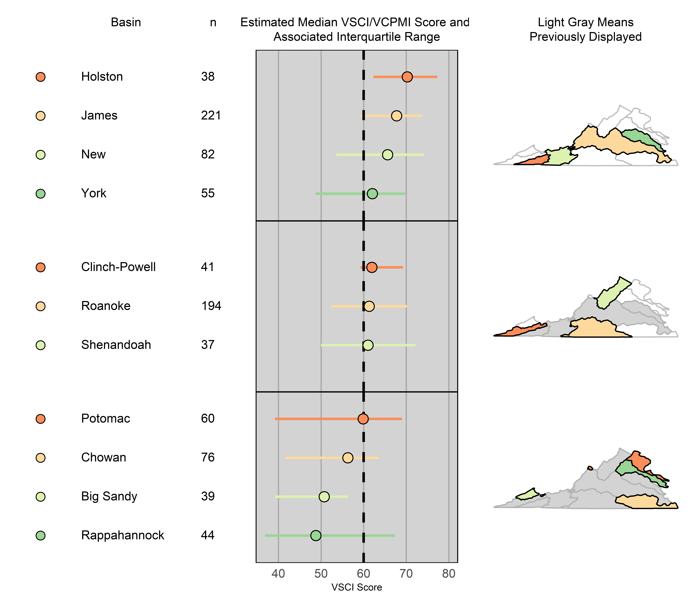

# Applications for the Environmental Field {#Ch11}


\chapterauthor{Michael G. McManus, Marcus W. Beck, J{\"u}rgen Symanzik}

## Introduction {#Ch11-Introduction}
This chapter will give the purpose and description of linked micromaps as applied to environmental data using the R package **micromap**\index{R Packages!micromap}. We will ask what types of environmental data are most suited for summarizing and displaying as linked micromaps. Additionally, we will show how linked micromaps can be used in spatial data analysis. Our linked micromap examples are drawn from federal and state environmental agencies in the United States.

The purpose of a linked micromap is to show spatial locations corresponding to statistical estimates [@COCPC1998]. Linked micromaps simultaneously summarize and display both statistical and geographic distributions by linking statistical summaries of polygons, or areal units, to a series of small maps [@PMWOK2015JSS]. Implicit with this purpose and description is that space, defined as spatial contiguity of polygons, provides some context to the statistical estimates, and that the statistical estimates are representative of the polygons. That spatial context to statistical estimates can be one of three patterns:  spatial similarity among neighbors, spatial dissimilarity among neighbors, or no spatial pattern among neighbors. @MPRG2016 illustrated that first pattern, while the examples below by the Virginia Department of Environmental Quality (VDEQ) and Florida Department of Environmental Protection (FDEP) illustrate the second and third patterns, respectively [@SWSCSS2018;@VirginiaDEQ2020]. All three of those examples also addressed the issue of obtaining statistical estimates of environmental data that were representative of watersheds, the polygons, used in the analysis. 

Public health statistics are often reported by administrative boundaries, such as counties, states, or countries, whereas environmental statistics are often reported by boundaries of natural features, such as watersheds, estuaries, or ecoregions. A census of environmental characteristics from such natural features is not possible. Consequently, environmental statisticians have recommended probability-based surveys or sampling to obtain representative estimates of natural resources [@PUW1999]. Probability-based surveys have three steps:  1) Identify the total or target population of interest (e.g. all wadeable streams in Virginia), 2) Select a random sample to ensure representativeness with the known probability of including any member of the target population, and 3) apply the sample weight, the inverse of the probability, to the environmental measurements so that inferences can be made to the target populations based on the samples [@PUW1999]. @SO2004 introduced spatially balanced probabilistic surveys as having sample sites distributed evenly over the extent of the natural resource is more efficient than a random sample of sites, in which clumping of sites may occur. The design and analysis of spatially balanced probabilistic surveys is done using the R package Spatial Sampling Design and Analysis, **spsurvey**\index{R Packages!spsurvey} [@DKOW2022; @OKP2012]. Statistical estimates of natural resources have been made from spatially balanced probabilistic surveys of ecoregions of the conterminous United States as part US EPA’s National Aquatic Resource Surveys to watersheds within a state.

## Recent Geovisualizations with Environmental Data {#Ch11-Geovisualizations}

Virginia Department of Environmental Quality and Florida Department of Environmental Protection both implemented spatially balanced probabilistic surveys of aquatic resources and visualized the results of the surveys using linked micromaps.  Under the Clean Water Act in the United States, states must report on the condition or status of their lakes, rivers, streams, and estuaries.  To meet this requirement, VDEQ has conducted such surveys of perennial, non-tidal, wadeable streams and rivers from 2001-2018 and has collected aquatic macroinvertebrates at stream sites for biological monitoring [@VirginiaDEQ2020]. The aquatic macroinvertebrates indicate the ecological conditions of a stream and are expressed as a Stream Condition Index (SCI) on a numeric scale, and from the surveys estimates of the SCI score can be made among the 11 major river basins in Virginia and compared to a statewide threshold value [@VirginiaDEQ2020]. The higher the index score indicates better ecological condition of the streams.

```{r Ch11-micromapExternal, fig.cap = 'VDEQ Micromap.', out.width = '90%', echo = FALSE}

```

Unlike a choropleth map, the SCI linked micromap produced by VDEQ displays *both* a measure of central tendency and a measure of variation for each of the 11 major river basins (Fig. 11-1). Specifically, the statistical panel of the linked micromap shows the estimated median SCI score and the interquartile range (IQR), as the estimated 25th and 75th percentiles, with the basin ranked by their medians. Those statistics are compared to a statewide threshold SCI of 60. Close inspection of the linked micromap reveals an interesting spatial dissimilarity for the southwestern basins of Holston, Clinch-Powel, and Big Sandy, all of which are part of the Tennessee River drainage, as Holston has excellent condition based on its SCI score, Clinch-Powell has good condition, and Big Sandy has severe stress. Also, worth noting, is that the 75th percentile of the poorest scoring basin, Rappahannock, extends past the statewide threshold indicates that some sites might benefit from conservation efforts as opposed to poorer scoring sites, which might need remediation to improve their condition. The Integrated Report included additional linked micromaps having two statistical panels, with one panel having the basin estimates of a water quality stressor and that was paired with another panel of the SCI [@VirginiaDEQ2020]. That pairing of a potential stressor with the SCI response provided a visualization of stressors that might have a larger impact on aquatic macroinvertebrates relative to other basins [@VirginiaDEQ2020]. The VDEQ linked micromap provided a means to show measures of variation, along with comparison to a reference value. 

While the VDEQ R code builds off Chapter \@ref(Ch2), some distinct arguments and layouts are worth mentioning. The VDEQ linked micromap feature asymmetrical perceptual grouping as specified by `grouping=c(4,3,4)`, followed by `vertical.align = "center"`. That argument aligns the rows within a perceptual group, rather than the default alignment of "top". The center alignment is helpful when perceptual groups contain different number of rows. This is a five panel linked micromap showing a unique aspect of two label panels by using this syntax: `panel.types=c('dot_legend', 'labels','labels', 'dot_cl', 'map')`. The first label specification corresponds to Basin in the `panel.data`, while the second label specification corresponds to n.  From both of those calls, the linked micromap displays the names of basin and their sample size. The VDEQ ecologists cleverly recognized that they could report a three-number summary of estimates of the median, first quartile, and third quartile in their linked micromap simply by using dot_cl.  The dot_cl argument is typically use to report a central tendency estimate, such as a mean or median, and then the lower and upper confidence limits, as @MPRG2016 did. Finally, in that same statistical panel, the overall statewide median estimate of SCI was displayed by using these arguments:
`add.line=60,add.line.col='black',add.line.typ='dashed'`.

```{r Ch11-micromap1Mike, fig.width = 7, fig.height = 9, fig.cap = 'A Virginia Linked Micromap.'}

library(micromap)

# initial example
stats <- readRDS("data/stats.RDS")
map.table <- readRDS("data/map.table.RDS")

 mmplot(stat.data=stats,
         map.data=map.table,
         map.link=c("Basin", "ID"),
         panel.types=c('dot_legend', 'labels','labels', 'dot_cl', 'map'),
         panel.data=list(NA,'Basin','n',list('x50', 'x25', 'x75'),NA),
         ord.by='x50',
         grouping=c(4,3,4),
         vertical.align = "center",
         median.row=F,
         plot.height=7,
         plot.width=8,
         colors=brewer.pal(3, "Spectral"),
         rev.ord=T,
         panel.att=list(list(1, point.type=20, point.border=TRUE, point.size=2),
                        list(2, header='Basin', panel.width=.5, 
                             align='left', text.size=.9),
                        list(3,header='n',panel.width=.2,align='left',text.size=.9),
                        list(4, header='Estimated Median VSCI/VCPMI Score and \nAssociated Interquartile Range',
                             graph.bgcolor='lightgray', point.size=1.5,
                             xaxis.ticks=list(40,50,60,70,80), xaxis.labels=list(40,50,60,70,80)
                             ,add.line=60,add.line.col='black',add.line.typ='dashed',
                             xaxis.title='VSCI Score'),
                        list(5, header='Light Gray Means\nPreviously Displayed',
                             map.all=TRUE, fill.regions='aggregate',
                             active.border.color='black', active.border.size=1.0,
                             inactive.border.color=gray(.7), inactive.border.size=1, 
                             panel.width=1.0)))

```


```{r Ch11-micromap2Mike, fig.width = 7, fig.height = 9, fig.cap = 'A Florida Linked Micromap.'}
library(micromap)

# initial example
Land4_Imida_NA <- readRDS("data/Land4_Imida_NA.rds")
FL_Basins <- readRDS("data/Florida_Basins.rds")

mmplot(stat.data=Land4_Imida_NA, 
                 map.data=FL_Basins,
                 panel.types=c('dot_legend','labels','labels','dot','dot','box_summary','map'),
                 panel.data=list(NA,'GROUP_NAME','Sum_PNT_COUNT','Imidacloprid','Percent_Ag_Ur_Tr',
                                 list('Imida_Min','Imida_25','Imida_Med','Imida_75','Imida_Max'),
                                 NA),       
                 map.link=c('GROUP_NAME','ID'),
                 ord.by='Imidacloprid',
                 rev.ord = TRUE,
                 grouping=c(6,6,5,6,6), ##median.row=F,
                 vertical.align = 'center',
                 plot.panel.spacing = 2,
                 plot.height=6, 
                 plot.width = 9,
                 colors=c('red','orange','yellow', 'green','blue','purple'),
                 print.res = 900,
                 
                 panel.att=list(list(1, point.type=20, point.border=TRUE, panel.width=1, point.size=2),
                                
                                list(2, header='Basin\nName', panel.width=.9, 
                                     align='left', left.margin=-1.6, text.size=.65), 
                                
                                list(3, header='Sample\nSize',panel.width=.1,
                                     align='right', left.margin=-1.6, text.size=.65),
                                
                                list(4, header='Imidacloprid\nDetected',
                                     graph.bgcolor='lightgray', point.size=1,
                                     xaxis.ticks=list(0,25,50,75), xaxis.labels=list(0,25,50,75),
                                     xaxis.title='Percent', left.margin=-1.6,
                                     panel.width=.4),
                                
                                list(5, header='Ag + Urban\nLand Use',
                                     graph.bgcolor='lightgray', point.size=1,
                                     xaxis.ticks=list(0,25,50,75), xaxis.labels=list(0,25,50,75), 
                                     xaxis.title='Percent', left.margin=-1.6,
                                     panel.width=.4),
                                
                                list(6, header='Imidacloprid Median          \nmin, 25th, 75th, & max',
                                     graph.bgcolor='lightgray',
                                     xaxis.ticks=list(-3,-2.5,-2,-1.5,-1,-0.5,0), xaxis.labels=list(-3,-2.5,-2,-1.5,-1,-0.5,0),
                                     xaxis.title='Log micrograms per liter', 
                                     graph.bar.size = 0.4, left.margin=-1.6,
                                     panel.width=.75),
                                
                                list(7, header='Gray Means            \n  Previously Displayed',
                                     map.all=TRUE, fill.regions='aggregate',
                                     active.border.color='black', active.border.size=1, left.margin=-1.6,
                                     panel.width=.6)))


```


As a reminder, see Chapter \@ref(Ch1) for general style requirements
for our `Micromap Plots in R` book. In particular, please do the following:

- Introduce meaningful labels for the sections, figures, and tables in your chapter.

- Create index entries for all R packages (such as the **micromap**\index{R Packages!micromap} R package)
and for all datasets (such as the _USstates_\index{Datasets!USstates} and _edPov_\index{Datasets!edPov} datasets)
that are used in your chapter.

- Include references for R packages and publications related to your chapter,
such as for the **micromap**\index{R Packages!micromap} [@PaOl2015] and 
**micromapST**\index{R Packages!micromapST} [@CP2015CRAN] R packages
and some micromap articles, book chapters, and books [@Carr2001;@SC2008;@CP2010].

- Also create index entries for main topics such as
linked micromap plots,\index{Linked micromap plot}
conditioned choropleth maps,\index{Conditioned choropleth map}
perceptual group,\index{Perceptual group}
color blindness,\index{Color blindness},
and quantile-quantile plot.\index{Quantile-quantile plot}


## Main {#Ch11-Main}


Here goes the main content of your chapter. Introduce additional sections as needed.

For convenience, Figure \@ref(fig:Ch11-micromap1) shows one linked micromap plot\index{Linked micromap plot}
(which is the same as in Figure \@ref(fig:Ch1-micromap1)), but now formatted in a slightly more meaningful way.


```{r Ch11-micromap1, fig.cap = 'Here is a first micromap example for this chapter. Note that the figure is formatted in a slightly more meaningful way this time.', fig.width = 7, fig.height = 9}
library(micromap)

# initial example

data(USstates)
statePolys <- create_map_table(USstates, "ST")
data(edPov)

# basic figure 1
lmplot(
  stat.data = edPov,
  map.data = statePolys,
  panel.types = c("labels", "dot", "dot", "map"),
  panel.data = list("state", "pov", "ed", NA),
  ord.by = "pov",   
  grouping = 5, 
  median.row = TRUE,
  plot.width = 2, 
  plot.height = 6,
  map.link = c("StateAb", "ID")
)
```


## Further Reading {#Ch11-FurtherReading}


Introduce cross-references to other chapters, e.g., Chapter \@ref(Ch1) and Chapter \@ref(Ch2),
where related work and further examples can be found in this book that match the content of this
chapter, that follow up on this chapter, or that are a prerequisite of this chapter.

Also, do some scientific literature review here that is specific to your chapter.
Where has this R package been introduced and used before, where have other plot types
or different countries been used in micromaps, what were other applications 
of micromaps that are related to the title and content of your chapter, etc.?


\printbibliography[segment=\therefsegment,heading=subbibliography]

