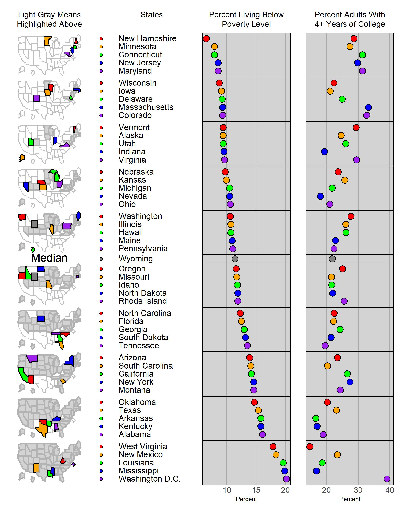

--- 
title: "Micromap Plots in R"
subtitle: "A Step-By-Step Approach to Visualize Spatial Data via Linked Micromaps, Conditioned Micromaps, and Comparative Micromaps in R"
author: "J&uuml;rgen Symanzik"
date: "`r Sys.Date()`"
output:
  pdf_book:
    keep_tex: yes
    latex_engine: xelatex
  pdf_document: default
  html_document:
    df_print: paged
knit: "bookdown::render_book"
bibliography:
- book.bib
- packages.bib
- referencesMicromaps.bib
biblio-style: apa
biblatexoptions: [refsegment=chapter]
link-citations: yes
colorlinks: yes
lot: yes
lof: yes
site: bookdown::bookdown_site
description: A book example for a Chapman & Hall book.
graphics: yes
documentclass: krantz
header-includes:
  - \usepackage{lipsum}
  - \usepackage{suffix}
---

\renewcommand\chapterauthor[1]{\authortoc{#1}\printchapterauthor{#1}}

\makeatletter
\newcommand{\printchapterauthor}[1]{%
  {\parindent0pt\vspace*{-25pt}%
  \linespread{1.1}\large\scshape#1%
  \par\nobreak\vspace*{35pt}}}
\newcommand{\authortoc}[1]{%
  \addtocontents{toc}{\vskip-10pt}%
  \addtocontents{toc}{%
    \protect\contentsline{chapter}%
    {\hskip1.3em\mdseries\scshape\protect\scriptsize#1}{}{}}
  \addtocontents{toc}{\vskip5pt}%
}
\makeatother


```{r Setup2, include=FALSE}
options(
  htmltools.dir.version = FALSE, formatR.indent = 2, width = 55, digits = 4
)

# install the packages needed by this book; you fill out c(), e.g. c('ggplot2', 'dplyr')
lapply(c('xfun'), function(pkg) {
  if (system.file(package = pkg) == '') install.packages(pkg)
})

# hide messages and warnings from all code chunks
knitr::opts_chunk$set(message = FALSE, warning = FALSE)
```

# Preface {-}

This is the preface for the `Micromap Plots in R` book.


## Why read this book {-}

You will learn a lot about all types of micromap plots.


## Structure of the book {-}

Chapter \@ref(Ch1) provides a general overview on all types of micromap plots and provides
an overview of the following chapters of the book.

Chapter \@ref(Ch2) introduces the **micromap**\index{R Packages!micromap} R package.
Chapter \@ref(Ch3) introduces the **micromapST**\index{R Packages!micromapST} R package.


## Software information and conventions {-}

I used the **knitr**\index{R Packages!knitr} R package [@R-knitr] and 
the **bookdown**\index{R Packages!bookdown} R package [@R-bookdown] to compile the book. 
Also see the [@xie2015] book.

My R session information is shown below:

```{r SessionInfo}
xfun::session_info()
```

Package names are in bold text (e.g., **rmarkdown**), and inline code and filenames are formatted in a typewriter font (e.g., `knitr::knit('foo.Rmd')`). Function names are followed by parentheses (e.g., `bookdown::render_book()`).


## Acknowledgments {-}

A lot of people helped me when I was writing the book. More to come later.

```{block2, type = 'flushright', html.tag = 'p'}
J&uuml;rgen Symanzik  
Logan, Utah, USA
```


<!--chapter:end:index.Rmd-->

# About the Author {-}

J&uuml;rgen Symanzik is a Professor in the Department of Mathematics and Statistics at
Utah State University in Logan, Utah, USA.

I need to check with CRC Press how to introduce all the chapter authors, 
e.g., via a few lines of text or by listing them by name and indicating
the affiliations (and e-mail addresses).


<!--chapter:end:00-author.Rmd-->

\mainmatter


# Introduction {#Ch1}


\chapterauthor{J{\"u}rgen Symanzik}


Please look at the source code for this chapter (i.e., the file `01-introduction.Rmd`) carefully. 
It provides an overview how to label and reference other chapters, sections, figures, and tables in your chapter.
It also outlines how and what to index and how to include citations in your chapter.

Eventually, this chapter will become the real introduction for our `Micromap Plots in R` book.
Minimal templates for actual chapters can be found in the files `02-micromap.Rmd`, `03-micromapST.Rmd`, etc.

The ultimate summary for this chapter will be based on the following text:

This chapter will provide a brief overview of the history of micromap plots, 
main application areas, and existing software for the creation of micromaps. 
A summary of the following eleven chapters of this book will also be provided.


## Use of Bookdown {#Ch1-Bookdown}


This section contains some basic information related to bookdown. For further details, see
https://bookdown.org/
and specifically
https://bookdown.org/yihui/bookdown/.

For an overview how to use bookdown for CRC Press / Taylor & Francis books, see
https://yihui.org/en/2018/08/bookdown-crc/
and
https://www.routledge.com/bookdown-Authoring-Books-and-Technical-Documents-with-R-Markdown/Xie/p/book/9781138700109.


## Creating Figures and Tables {#Ch1-FigsAndTables}


Here are some basic examples how to create figures and tables in bookdown.
We have a figure in Figure \@ref(fig:Ch1-CarsScatterplot) that makes
use of the _cars_\index{Datasets!cars} dataset
and also a table in Table \@ref(tab:Ch1-IrisTable) that makes
use of the _iris_\index{Datasets!iris} dataset.
See these examples how to create automatic figure and table numbers in your R code chunks 
and how to reference them in the main text. Also, please cite all data sets that
are used in your chapter.

Use meaningful identifiers that start with the letters **Ch**, 
followed by the number of your chapter and a dash (such as Ch1-, Ch2-, etc.) so that we
can eventually cross-reference figures across chapters (and also avoid that the 
same identifier is used more than once in different chapters).


```{r Ch1-CarsScatterplot, out.width = '90%', fig.cap = 'A trivial scatterplot of the cars data set.'}
par(mar = c(4, 4, 1, 0.1))
plot(cars, pch = 19)
```


```{r Ch1-IrisTable}
knitr::kable(
  head(iris), 
  caption = "A table of the iris data.",
  booktabs = TRUE
)
```

## Indexing {#Ch1-Indexing}


As already done in the previous sections, index all R packages such as
**ggplot2**\index{R Packages!ggplot2} and
**ggmap**\index{R Packages!ggmap} R packages.

Also provide an index entry for all datasets, such as the
_cars_\index{Datasets!cars} and the _iris_\index{Datasets!iris} datasets.

For R packages and datasets, use the actual R spelling. Do not change the capitalization.

One final word on indexing: Please capitalize the first word of the index entry in a sequence of words, e.g.,
perceptual group,\index{Perceptual group}
color blindness,\index{Color blindness},
and quantile-quantile plot.\index{Quantile-quantile plot}

In case you want to use abbreviations, please introduce them first, e.g.,
linked micromap plots\index{Linked micromap plot} (LMplots\index{LMplot|see {Linked micromap plot}}) and
conditioned choropleth maps\index{Conditioned choropleth map} (CCmaps\index{CCmap|see {Conditioned choropleth map}}).

Introduce a cross-reference index entry for the abbreviation (see the examples above),
but always list the full length-index entry for the index.

See https://en.wikibooks.org/wiki/LaTeX/Indexing
for other indexing options.


## Citations and References {#Ch1-CitationsReferences}


Here are some examples for citations: @R-bookdown and @xie2015 are references from the preface.
These citations appear as nouns in the text.

These are some micromap articles, book chapters, and books [@Carr2001;@SC2008;@CP2010].
These are references for the **micromap**\index{R Packages!micromap} [@PaOl2015] and 
**micromapST**\index{R Packages!micromapST} [@CP2015CRAN] R packages.
All of these citations appear in parentheses. 
**Note the use of the semicolon in the first set of articles, book chapters, and books.**
Also note that three different bib files have been used here to create the final bibliography.

See here for further details on citations in bookdown:
https://bookdown.org/yihui/bookdown/citations.html.

**I have provided an updated bibtex file with a large number of micromap-related references,
called `referencesMicromaps.bib` - see 
https://github.com/symanzik/MicromapPlotsInR/blob/master/referencesMicromaps.bib.
See Appendix \@ref(Ch99-MicromapReferenceOverview) for the references that are already listed
in the bibtex file.
Most of the underlying articles, book chapters, posters, etc. will be made available via a Box folder
within the next few days. Look for my e-mail.**


## Micromap Examples {#Ch1-MicromapExamples}


While Section \@ref(Ch1-FigsAndTables) discussed general figure and table creation, this section focuses on micromaps.

The following examples have been taken from the `lmplot()` help page of the **micromap**\index{R Packages!micromap} R package.
Figure \@ref(fig:Ch1-micromap1) shows the first basic linked micromap plot\index{Linked micromap plot}
that makes use of the _USstates_\index{Datasets!USstates} and _edPov_\index{Datasets!edPov} datasets.

Overall, write and format your R code according to the tidyverse R style, summarized at
https://style.tidyverse.org/index.html.
As many of our function calls for micromaps require a large number arguments, see Section 2.5 called `Long Lines'
(https://style.tidyverse.org/syntax.html#long-lines)
how to format such function calls.


```{r Ch1-micromap1, out.width = '90%', fig.cap = 'Here is a first micromap example. Note that it occupies 90 percent of the page width. The rows are far too much condensed.'}
library(micromap)

# initial example

data(USstates)
head(USstates@data)
statePolys <- create_map_table(USstates, "ST")
head(statePolys)

data(edPov)

# basic figure 1
lmplot(
  stat.data = edPov,
  map.data = statePolys,
  panel.types = c("labels", "dot", "dot", "map"),
  panel.data = list("state", "pov", "ed", NA),
  ord.by = "pov",   
  grouping = 5, 
  median.row = TRUE,
  plot.width = 2, 
  plot.height = 6,
  map.link = c("StateAb", "ID")
)
```


This gets further refined now. Figure \@ref(fig:Ch1-micromap2) shows the resulting second micromap plot.


```{r Ch1-micromap2, fig.cap = 'And here is a second micromap example. This uses the default output settings. This still looks very bad.'}
# publication figure 1a
lmplot(
  stat.data = edPov,
  map.data = statePolys ,
  panel.types = c("labels", "dot", "dot", "map"),
  panel.data = list("state", "pov", "ed", NA),
  ord.by = "pov",  
  grouping = 5,
  median.row = TRUE,
  map.link = c("StateAb", "ID"),
  
  plot.height = 9,
  
  colors = c("red", "orange", "green", "blue", "purple"), 
  map.color2 = "lightgray",
  
  panel.att = list(
    list(1, header = "States", 
         panel.width = 0.8, 
         align = "left", 
         text.size = 0.9),
    list(2, header = "Percent Living Below\nPoverty Level",
         graph.bgcolor = "lightgray", 
         point.size = 1.5,
         xaxis.ticks = list(10, 15, 20), 
         xaxis.labels = list(10, 15, 20),
         xaxis.title = "Percent"),
    list(3, header = "Percent Adults With\n4+ Years of College",
         graph.bgcolor = "lightgray", 
         point.size = 1.5,
         xaxis.ticks = list(10, 20, 30, 40), 
         xaxis.labels = list(10, 20, 30, 40),
         xaxis.title = "Percent"),
    list(4, header = "Light Gray Means\nHighlighted Above",  
         inactive.border.color = gray(0.7), 
         inactive.border.size = 2,	
         panel.width = 0.8)
  )
)
```


Some more refinements, resulting in Figure \@ref(fig:Ch1-micromap3).


```{r Ch1-micromap3, fig.cap = 'And now the third (revised) micromap example. Note that this specifies a width and height for the figure. This may be the best solution to scale the micromap plots.', fig.width = 7, fig.height = 9}
edPov$points <- 0	

# publication figure 1b
lmplot(
  stat.data = edPov, 
  map.data = statePolys,
  panel.types = c("dot", "labels", "dot", "dot", "map"),
  panel.data = list("points", "state", "pov", "ed", NA),
  map.link = c("StateAb", "ID"),
  ord.by = "pov", 
  grouping = 5, 
  median.row = TRUE, 
  
  plot.height = 9, 
  
  colors = c("red", "orange", "green", "blue", "purple"),
  map.color2 = "lightgray", 
  
  panel.att = list(
    list(1, panel.width = 0.15, 
         point.type = 20,
         graph.border.color = "white",
         xaxis.text.display = FALSE, 
         xaxis.line.display = FALSE,
         graph.grid.major = FALSE),
    
    list(2, header = "States", 
         panel.width = 0.8, 
         align = "left", 
         text.size = 0.9),
    
    list(3, header = "Percent Living Below\nPoverty Level",
         graph.bgcolor = "lightgray", 
         point.size = 1.5,
         xaxis.ticks = list(10, 15, 20), 
         xaxis.labels = list(10, 15, 20),
         xaxis.title = "Percent"),
    
    list(4, header = "Percent Adults With\n4+ Years of College",
         graph.bgcolor = "lightgray", 
         point.size = 1.5,
         xaxis.ticks = list(20, 30, 40), 
         xaxis.labels = list(20, 30, 40), 
         xaxis.title = "Percent"),
    
    list(5, header = "Light Gray Means\nHighlighted Above", 
         inactive.border.color = gray(0.7), 
         inactive.border.size = 2, 
         panel.width = 0.8)
  )
)
```


## Alternative Creation and Inclusion of Figures {#Ch1-AlternativeMicromapExample}


Final refinements. Here, the code is run separately. The figure is not shown directly.
Rather, an external figure (jpeg or pdf) is created. Eventually, 
in Figure \@ref(fig:Ch1-micromap5), this externally created figure is included into the text.

**Even though this works, I would suggest to always use the approach from the previous section, i.e.,
Section \@ref(Ch1-MicromapExamples), whenever possible.** Exceptions are externally created files
or sceenshots, e.g., from a **Shiny**\index{R Packages!Shiny} app, that could be included this way.  Note that the external figures should be placed in the `img` folder and should be jpeg format.


```{r Ch1-micromap4}
# publication figure 1c
lmplot(
  stat.data = edPov, 
  map.data = statePolys,
  panel.types = c("map", "dot",  "labels", "dot", "dot"),
  panel.data = list(NA, "points", "state", "pov", "ed"),
  map.link = c("StateAb", "ID"),
  ord.by = "pov", 
  grouping = 5, 
  median.row = TRUE,
  
  plot.height = 9, 
  
  colors = c("red", "orange", "green", "blue", "purple"),
  map.color2 = "lightgray", 
  
  print.file = "img/Ch1-micromap4-external.jpeg",
  
  panel.att = list(
    list(2, panel.width = 0.15, 
         point.type = 20,
         graph.border.color = "white",
         xaxis.text.display = FALSE, 
         xaxis.line.display = FALSE,
         graph.grid.major = FALSE),
    
    list(3, header = "States", 
         panel.width = 0.8, 
         align = "left", 
         text.size = 0.9),
    
    list(4, header = "Percent Living Below\nPoverty Level",
         graph.bgcolor = "lightgray", 
         point.size = 1.5,
         xaxis.ticks = list(10, 15, 20), 
         xaxis.labels = list(10, 15, 20),
         xaxis.title = "Percent"),
    
    list(5, header = "Percent Adults With\n4+ Years of College",
         graph.bgcolor = "lightgray", 
         point.size = 1.5,
         xaxis.ticks = list(20, 30, 40), 
         xaxis.labels = list(20, 30, 40), 
         xaxis.title = "Percent"),
    
    list(1, header = "Light Gray Means\nHighlighted Above", 
         inactive.border.color = gray(0.7), 
         inactive.border.size = 2, 
         panel.width = 0.8)
  )
)
```


```{r Ch1-micromap5, fig.cap = 'And now the fourth (and final) micromap example.', out.width = '90%', echo = FALSE}
#options(knitr.graphics.auto_pdf = TRUE)


```

\newpage


## Translating the Book Chapters to pdf and html Output {#Ch1-Translating}


**The following instructions assume that you will be working locally on your
own computer on your own chapter only. If you are familiar with git and github
(and how to use these from RStudio), adjust the workflow accordingly
to directly collaborate and interact with other chapter authors 
who will be using git and github. The use of git and github is optional.
If you do not want to use these, you can always provide me with your Rmd
and other source files.**

Our book lives on
https://github.com/symanzik/MicromapPlotsInR.
This is a public directory. Everyone will be able to see the advancement
of our book and provide feedback. I plan to provide stable updates on
a regular basis. If you are familiar with git and github, simply pull
new versions from the repository.

If you do not want to use git and github at this time, please do the following:
Select `Code -> Download ZIP` on the github page above.
Unzip the ZIP file where you want to host these files locally on your computer.

Open the R project file `MicromapPlotsinR.Rproj` in RStudio by double clicking on it.
Ideally, always work in the framework of this R project while working on your book chapter.

Open the Rmd file that serves as a template for your chapter, e.g., `02...Rmd`. Also open 
`index.Rmd` and `01-introduction.Rmd` to see how certain features 
(such as R code, references, index entries, etc.) can be produced in bookdown.
To do so, simply click on the file names in the RStudio **Files** menu.

Bookdown assumes that all files with extension .Rmd in a directory belong to the same book project.
The file `index.Rmd` always is the main document. All additional Rmd files are read in sequential
alpha-numerical order. For this book, you can initially speed up the translation process if you move files
`02...Rmd`, `03...Rmd`, etc. (except your own chapter) into a different directory so they do not
get translated each time. However, this means that cross-references to different chapters will
not work. So, when you are about to finalize your chapter, please translate with all currently
provided Rmd files in place (i.e., copy these files back into your local directory).
Keep all other files and directories in the same directory structure as provided by me!
These are needed to produce the book, but it is unlikely that you have to edit them at all.
You likely will run into errors when trying to translate to pdf or html if some
of these files are missing.

Please do not modify the file `index.Rmd` on your side at all. If something needs
to be changed, it likely needs to be changed for all chapters. So, please let me know about such
necessary changes for the `index.Rmd` file. You should be fine if you just edit
the Rmd file for your chapter, i,e., `02...Rmd`, `03...Rmd`, etc.

Note that the short chapter summary at the start of a chapter 
has been adapted from my original book proposal for CRC Press.
Adjust as needed when your chapter is being written.
Also adjust your names, e.g., insert missing middle initials,
and change the author order as desired for your chapter.

To translate your chapter to html or pdf (and in fact, also translate all other Rmd files
that are in this directory), select **Build** from the RStudio menu that appears next to
**Environment** and **History** (often in the upper right corner of RStudio).
Note that there exists a second **Build** in the top menu of RStudio
(close to **Session** and **Debug**) -- this is not what we need.
You now should see the menu **Build Book**. 
Select **bookdown::pdf_book** to create the pdf version of the book.
Alternatively, select **bookdown::gitbook** to create the html version of the book.

If your translation to html or pdf does not work immediately, try the following:

- Check that you have all necessary R packages installed, in particular **bookdown**, **micromap**,
**micromapST**, and all their dependencies.  Note that the dependencies should be installed
automatically with each package, but some may require manual installation.
Chapter \@ref(Ch2) also needs the **labeling**, **rgeos**, **rgdal**, and **maptools** R packages.
If necessary, install missing R packages (and their dependencies) via 
`Tools -> Install Packages` in RStudio.

- Do you have recent versions (from 2022) of RStudio and R itself? If not, update them.
Updating R can be done most easiest via the `installr` R package and its `updateR()` function.
One recommendation: Do not delete the R packages from your current installation of R
until you are sure that they have been successfully transferred into the new installation of R.

- Are all R packages up to date? Check via `Tools -> Check for Package Updates`
in RStudio. Mismatching packages may be incompatible.
If packages still do not match, enforce an update of all R packages via 
the following. This is also a good idea when you updated to a new version of R,
but copied all your currently installed R packages to the new location:
```{r Ch1-UpdateRPackages, eval = FALSE}
update.packages(checkBuilt = TRUE, ask = FALSE)
```

At this time, you should be able to translate to html. Translation to pdf
may still require a few additional steps:

- Do you have some LaTeX version installed? If not, I would suggest
to install the full 6GB `texLive` version from 
https://www.tug.org/texlive/.
Alternatives are ` MiKTeX` (https://miktex.org/) or
`TinyTeX` (https://yihui.org/tinytex/).
After the installation, you should restart your computer.

- If you have a current installation of `MiKTeX` or `TinyTex`, but still
get errors when you try to translate to pdf, update your current installation
(including the used LaTeX packages).
Google for help how to do this for a certain installation of `MiKTeX` or `TinyTex`
for your operating system.

- If all of the above still do not work for you (but you can create the html version),
there are two options: 
(i) Just create the html version. But, this may require some more
back and forth later on during the review process of your chapter. 
(ii) Uninstall your current LaTeX installation, and install 
the full 6GB `texLive` version from 
https://www.tug.org/texlive/. This usually resolves all problems.
 
The html version of the book will be visually more appealing. The pdf version will be more complete.
Note that some of the pdf features of the book do not appear in the html version,
e.g., there are no chapter authors listed, no list of figures and no list of tables is produced,
no index is created, there is a different appearance of the references, and others. 
As the final delivery to CRC Press are the source files for the pdf version,
we do not have to focus on the html version at this time (but create the html
version if you don't get the translation to pdf to work on your side). If you are aware
how to modify the code (Rmd, yml, or other) to obtain a matching html version
for some of the missing / different features, please let me know. As far as I could see,
some of these features do not even exist for the html version at this time,
but of course, might be implemented while we are working on the book.

At this time, do not worry about any formatting issues, placement of figures, etc. 
in the pdf version. These will be addressed only once all chapter content has been finalized.


## External Data Files and Additional R Code {#Ch1-DataFilesRCode}


Likely, several of the book chapters are based on external data files and/or 
additional R code. Eventually, these have to be made available to our readers
in a meaningful way. This could be done via additional (new) R packages,
e.g., `MPIRdata` or `micromapExtra`. The underlying R code for some of the chapters 
itself could result in new R packages on CRAN or github. There are numerous
options. We do not have to decide at this time, but only later in the year
once we know how much additional material (data and R code) there will be.

For now, let's just deposit any external data and additional R code that is 
not directly part of a chapter into the `data` directory at 
https://github.com/symanzik/MicromapPlotsInR/data.
Please send your data and additional R files to me, best as a zip file, so
I can upload them to github.  Alternatively, the data can be pushed directly 
to the GitHub repository from a local version if you are familiar with Git 
and GitHub.

Overall, this will allow us to share data and additional R code among multiple
chapters. Someone may want to use a modified shapefile, a new plot type,
or create a different type of a Shiny app based on a micromap plot
introduced elsewhere in the book.

Assuming that the data directory is at the same directory level as the Rmd file
of a chapter, data can be imported into a chapter as follows:

```{r Ch1-Data, eval = FALSE}
data <- read.csv("data/file.csv")
load(file = "data/file.RData")
```

See Section \@ref(Ch2-CodeChunksChina) how I read in shapefiles and data for Chinese micromaps.
Note that this chapter is still highly experimental at this time!!!


\newpage


## Open Bookdown Questions {#Ch1-OpenBookdownQuestions}


I have to resolve a few open bookdown questions on my side:

- How to modify the appearance of R code chunks, e.g., reduced font size and reduced spacing? See
https://bookdown.org/yihui/rmarkdown-cookbook/chunk-styling.html
and
https://stackoverflow.com/questions/25646333/code-chunk-font-size-in-rmarkdown-with-knitr-and-latex
and
https://github.com/rstudio/rmarkdown/issues/388.
I need to look at some more examples and consult with CRC Press what they want for their books.

- How to add chapter authors to the header of each chapter and to the table of content? See
https://github.com/admindatahandbook/book/issues/4,
https://tex.stackexchange.com/questions/156862/displaying-author-for-each-chapter-in-book,
and
https://stackoverflow.com/questions/41655383/r-markdown-similar-feature-to-newcommand-in-latex/41664105.
This works for the pdf version, but needs some fine-tuning and consultation with CRC Press.

- How to create chapter-specific bibliographies at the end of each chapter, rather than a single
bibliography at the end of the book? See
https://stackoverflow.com/questions/45028623/is-there-a-way-to-add-chapter-bibliographies-using-bookdown,
https://tex.stackexchange.com/questions/525778/multiple-bibliographies-using-natbib-and-chapterbib-bibtex-illegal-error,
https://community.rstudio.com/t/one-bibliography-per-chapter-when-using-pandoc-for-citations/117105/2,
https://github.com/rstub/bookdown-chapterbib,
and
https://tex.stackexchange.com/questions/25701/bibtex-vs-biber-and-biblatex-vs-natbib.
This basically works now, but needs some fine-tuning.

Note that `apa` and `authoryear` settings for `biblio-style` are not exactly the same as `apalike`, 
but they come close. For example, the address field is ignored for books and book chapters. 
Also, notes and URLs are not exactly placed where they should be.
I need to check with CRC Press what is needed on their side.

Also, there may not be a need for a comprehensive bibliography at the end of the book. 
I need to check this with CRC Press as well.


\printbibliography[segment=\therefsegment,heading=subbibliography]


<!--chapter:end:01-introduction.Rmd-->

# Linked Micromap Plots via the **micromap** R Package {#Ch2}


\chapterauthor{J{\"u}rgen Symanzik, Marcus W. Beck, Michael McManus}


The **micromap**\index{R Packages!micromap} R package [@PaOl2015],
accessible at https://cran.r-project.org/web/packages/micromap/index.html,
will be introduced in this chapter. The reader will learn how to create a 
basic linked micromap plot\index{Linked micromap plot} via this R package. 
Details will be provided how to optimize and fine-tune such a basic plot 
into a publication-worthy final linked micromap plot.


## Introduction {#Ch2-Introduction}


As a reminder, see Chapter \@ref(Ch1) for general style requirements
for our `Micromap Plots in R` book. In particular, please do the following:

- Introduce meaningful labels for the sections, figures, and tables in your chapter.

- Create index entries for all R packages (such as the **micromap**\index{R Packages!micromap} R package)
and for all datasets (such as the _USstates_\index{Datasets!USstates} and _edPov_\index{Datasets!edPov} datasets)
that are used in your chapter.

- Include references for R packages and publications related to your chapter,
such as for the **micromap**\index{R Packages!micromap} [@PaOl2015] and 
**micromapST**\index{R Packages!micromapST} [@CP2015CRAN] R packages
and some micromap articles, book chapters, and books [@Carr2001;@SC2008;@CP2010].

- Also create index entries for main topics such as
linked micromap plots,\index{Linked micromap plot}
conditioned choropleth maps,\index{Conditioned choropleth map}
perceptual group,\index{Perceptual group}
color blindness,\index{Color blindness},
and quantile-quantile plot.\index{Quantile-quantile plot}


## Main {#Ch2-Main}


Here goes the main content of your chapter. Introduce additional sections as needed.

For convenience, Figure \@ref(fig:Ch2-micromap1) shows one linked micromap plot\index{Linked micromap plot}
(which is the same as in Figure \@ref(fig:Ch1-micromap1)), but now formatted in a slightly more meaningful way.


```{r Ch2-micromap1, fig.cap = 'Here is a first micromap example for this chapter. Note that the figure is formatted in a slightly more meaningful way this time.', fig.width = 7, fig.height = 9}
library(micromap)

# initial example

data(USstates)
statePolys <- create_map_table(USstates, "ST")
data(edPov)

# basic figure 1
lmplot(
  stat.data = edPov,
  map.data = statePolys,
  panel.types = c("labels", "dot", "dot", "map"),
  panel.data = list("state", "pov", "ed", NA),
  ord.by = "pov",   
  grouping = 5, 
  median.row = TRUE,
  plot.width = 2, 
  plot.height = 6,
  map.link = c("StateAb", "ID")
)
```


## Code Chunks {#Ch2-CodeChunks}


Example code chunks from Mike's workshop materials. Reduce some of the figures.


```{r Ch2-micromap2, fig.cap = 'Chunk 1.', fig.width = 7, fig.height = 9}
#I. Overview of Four Steps to Make a Linked Micromap

### I. A. Geoprocessing of Spatial Data
library(micromap)
sessionInfo()
getwd()

library(labeling)

data("USstates")
#Here is the spatial data
plot(USstates)
head(USstates@data)
```


```{r Ch2-micromap3, fig.cap = 'Chunk 1.', fig.width = 7, fig.height = 9}
### I. B. Structure:  Create a Map Table to Link to the Statistical Data
statePolys <- create_map_table(USstates, 'ST')
#The spatial data is now in a simpler form that the micromap package can use
head(statePolys)

data("edPov")
#Here is the statistical data.
head(edPov)
#The spatial and statistical data frames must have a common linking variable.
hist(1:100)
```


```{r Ch2-micromap4, fig.cap = 'Chunk 1.', fig.width = 7, fig.height = 9}
### I. C. Draft Micromap Plot
mmplot(stat.data=edPov,
       map.data=statePolys,
       map.link=c('StateAb', 'ID'),
       panel.types=c('dot_legend', 'labels', 'dot', 'dot', 'map'),
       panel.data=list(NA, 'state', 'pov', 'ed', NA),
       ord.by='pov',   
       grouping=5, median.row=TRUE)
```


```{r Ch2-micromap5, fig.cap = 'Chunk 1.', fig.width = 7, fig.height = 9}
### I. D. Basic Modification Exercises of Draft Micromap Plot

### I. D. a) Reorder the previous plot in decreasing order of poverty
mmplot(stat.data=edPov,
       map.data=statePolys,
       map.link=c('StateAb', 'ID'),
       panel.types=c('dot_legend', 'labels', 'dot', 'dot', 'map'),
       panel.data=list(NA, 'state', 'pov', 'ed', NA),
       ord.by='pov',   
       rev.ord=TRUE,
       grouping=5, median.row=TRUE)
```


```{r Ch2-micromap6, fig.cap = 'Chunk 1.', fig.width = 7, fig.height = 9}
### I. D. b) Change the order of the education and poverty panels and sort by decreasing education
mmplot(stat.data=edPov,
       map.data=statePolys,
       map.link=c('StateAb', 'ID'),
       panel.types=c('dot_legend', 'labels', 'dot', 'dot', 'map'),
       panel.data=list(NA, 'state', 'ed', 'pov', NA),
       ord.by='ed',   
       rev.ord=TRUE,
       grouping=5, median.row=TRUE)
```


```{r Ch2-micromap7, fig.cap = 'Chunk 1.', fig.width = 7, fig.height = 9}
### I. D. c) Place the maps on the left side
mmplot(stat.data=edPov,
       map.data=statePolys,
       map.link=c('StateAb', 'ID'),
       panel.types=c('map', 'dot_legend', 'labels', 'dot', 'dot'),
       panel.data=list(NA, NA, 'state', 'ed', 'pov'),
       ord.by='ed',   
       rev.ord=TRUE,
       grouping=5, median.row=TRUE)
```


```{r Ch2-micromap8, fig.cap = 'Chunk 1.', fig.width = 7, fig.height = 9}
### I. D. d) Try some different groupings, such as 6, 6, 6, 6, 3, 6, 6, 6, 6 (and no median.row)
mmplot(stat.data=edPov,
       map.data=statePolys,
       map.link=c('StateAb', 'ID'),
       panel.types=c('map', 'dot_legend', 'labels', 'dot', 'dot'),
       panel.data=list(NA, NA, 'state', 'ed', 'pov'),
       ord.by='ed',   
       rev.ord=TRUE,
       grouping=c(6, 6, 6, 6, 3, 6, 6, 6, 6), median.row=FALSE)
```


```{r Ch2-micromap9, fig.cap = 'Chunk 1.', fig.width = 7, fig.height = 9}
### I. D. e) Align the state names to the left, see panel.att page 5-6 User guide
mmplot(stat.data=edPov,
       map.data=statePolys,
       map.link=c('StateAb', 'ID'),
       panel.types=c('map', 'dot_legend', 'labels', 'dot', 'dot'),
       panel.data=list(NA, NA, 'state', 'ed', 'pov'),
       ord.by='ed',   
       rev.ord=TRUE,
       grouping=c(6, 6, 6, 6, 3, 6, 6, 6, 6), median.row=FALSE,
       panel.att=list(list(3, align='left')))
```


```{r Ch2-micromap10, fig.cap = 'Chunk 1.', fig.width = 7, fig.height = 9}
### I. D. f) Vertically align the state names to the center, see vertical.align page 17 User guide
mmplot(stat.data=edPov,
       map.data=statePolys,
       map.link=c('StateAb', 'ID'),
       panel.types=c('map', 'dot_legend', 'labels', 'dot', 'dot'),
       panel.data=list(NA, NA, 'state', 'ed', 'pov'),
       ord.by='ed',   
       rev.ord=TRUE,
       grouping=c(6, 6, 6, 6, 3, 6, 6, 6, 6), median.row=FALSE,
       vertical.align='center',
       panel.att=list(list(3, align='left')))
```


```{r Ch2-micromap11, fig.cap = 'Chunk 1.', fig.width = 7, fig.height = 9}
### I. D. g) Use a divergent 6-class BrBG color scheme from RColorBrewer (which is colorblind safe)
mmplot(stat.data=edPov,
       map.data=statePolys,
       map.link=c('StateAb', 'ID'),
       panel.types=c('map', 'dot_legend', 'labels', 'dot', 'dot'),
       panel.data=list(NA, NA, 'state', 'ed', 'pov'),
       ord.by='ed',   
       rev.ord=TRUE,
       grouping=c(6, 6, 6, 6, 3, 6, 6, 6, 6), median.row=FALSE,
       vertical.align='center',
       colors=brewer.pal(6, "BrBG"),
       panel.att=list(list(3, align='left')))
```


```{r Ch2-micromap12, fig.cap = 'Chunk 1.', fig.width = 7, fig.height = 9}
### I. E. Refine the Micromap Plot
mmplot(stat.data=edPov, map.data=statePolys,
        panel.types=c('dot_legend',  'labels', 'dot', 'dot', 'map'),
        panel.data=list(NA, 'state', 'pov', 'ed', NA),
        map.link=c('StateAb', 'ID'),
        ord.by='pov', 
        grouping=5, 
        median.row=TRUE, 
        
        plot.height=9, 
        
        colors=c('red', 'orange', 'green', 'blue', 'purple'),
        
        panel.att=list(list(1, point.type=20, point.border=TRUE, point.size=2),
                       
                       list(2, header='States', panel.width=.8, 
                            align='left', text.size=.9),
                       
                       list(3, header='Percent Living Below\nPoverty Level',
                            graph.bgcolor='lightgray', point.size=1.5,
                            xaxis.ticks=list(10, 15, 20), xaxis.labels=list(10, 15, 20),
                            xaxis.title='Percent'),
                       
                       list(4, header='Percent Adults With\n4+ Years of College',
                            graph.bgcolor='lightgray', point.size=1.5,
                            xaxis.ticks=list(20, 30, 40), xaxis.labels=list(20, 30, 40), 
                            xaxis.title='Percent'),
                       
                       list(5, header='Light Gray Means\nPreviously Displayed',
                            map.all=TRUE, fill.regions='aggregate',
                            active.border.color='black', active.border.size=1.5,
                            inactive.border.color=gray(.7), inactive.border.size=1, 
                            panel.width=.8)))
```


```{r Ch2-micromap13, fig.cap = 'Chunk 1.', fig.width = 7, fig.height = 9}
### I. F. Refine the Micromap Plot with adjusted ticmarks & ticmark labels
mmplot(stat.data=edPov, map.data=statePolys,
       panel.types=c('dot_legend',  'labels', 'dot', 'dot', 'map'),
       panel.data=list(NA, 'state', 'pov', 'ed', NA),
       map.link=c('StateAb', 'ID'),
       ord.by='pov', 
       grouping=5, 
       median.row=TRUE, 
       
       plot.height=9, 
       
       colors=c('red', 'orange', 'green', 'blue', 'purple'),
       
       panel.att=list(list(1, point.type=20, point.border=TRUE, point.size=2),
                      
                      list(2, header='States', panel.width=.8, 
                           align='left', text.size=.9),
                      
                      list(3, header='Percent Living Below\nPoverty Level',
                           graph.bgcolor='lightgray', point.size=1.5,
                           xaxis.ticks=as.list(extended(min(edPov$pov), max(edPov$pov), 3)), 
                           xaxis.labels=as.list(extended(min(edPov$pov), max(edPov$pov), 3)),
                           xaxis.title='Percent'),
                      
                      list(4, header='Percent Adults With\n4+ Years of College',
                           graph.bgcolor='lightgray', point.size=1.5,
                           xaxis.ticks=as.list(extended(min(edPov$ed), max(edPov$ed), 4)), 
                           xaxis.labels=as.list(extended(min(edPov$ed), max(edPov$ed), 4)), 
                           xaxis.title='Percent'),
                      
                      list(5, header='Light Gray Means\nPreviously Displayed',
                           map.all=TRUE, fill.regions='aggregate',
                           active.border.color='black', active.border.size=1.5,
                           inactive.border.color=gray(.7), inactive.border.size=1, 
                           panel.width=.8)))
```


```{r Ch2-micromap14, fig.cap = 'Chunk 1.', fig.width = 7, fig.height = 9}
hist(1:100)
```


## Code Chunks China {#Ch2-CodeChunksChina}


```{r Ch2-micromaChina1, fig.cap = 'Chunk 1.', fig.width = 7, fig.height = 9}
#VI. Use of external shapefiles

library(rgeos)
library(rgdal)
library(maptools)

library(micromap)

### Read in the shapefile and simplify the polygons (run this part of the code only once!)

ChinaShapefile <- readOGR("data/China_Shapefiles", "export", verbose = TRUE)
plot(ChinaShapefile)
summary(ChinaShapefile)
```


```{r Ch2-micromaChina2, fig.cap = 'Chunk 1.', fig.width = 7, fig.height = 9}
gIsValid(ChinaShapefile, byid = TRUE, reason = TRUE)
ChinaShapefileThin <- thinnedSpatialPoly(ChinaShapefile, 
                                         tolerance = 300, # try 100, 300, 3000, 30000
                                         minarea = 10000000000,
                                         topologyPreserve = TRUE, 
                                         avoidGEOS = TRUE)
ChinaShapefileThin <- gBuffer(ChinaShapefileThin, width = 0, byid = TRUE)
gIsValid(ChinaShapefileThin, byid = TRUE, reason = TRUE)
plot(ChinaShapefileThin)

### Change tolerance to 100, 3000, and 30000 and run the the entire code again, starting with readOGR.
### Which of these is the best choice for tolerance? You may have to enlarge the map.

### If you plan to use LM plots for a research project, you may also want to 
### enlarge small regions or shift far-away regions closer to the main region.
### Talk to me for further information.
```


```{r Ch2-micromaChina3, fig.cap = 'Chunk 1.', fig.width = 7, fig.height = 9}
### Read in the data

religion <- read.csv("data/China_ReligionData.csv", header = TRUE)

ChinaPolys <- create_map_table(ChinaShapefileThin, "ename")

### Basic micromap plot

ChinaPlot <- mmplot(stat.data = religion,
                    map.data = ChinaPolys,
                    panel.types = c("labels", "dot", "map"),
                    panel.data = list("Province", "Christianity", NA),
                    ord.by = "Christianity",
                    grouping = 5,
                    median.row = TRUE, 
                    map.link = c("Province", "ID"))
```


```{r Ch2-micromaChina4, fig.cap = 'Chunk 1.', fig.width = 7, fig.height = 9}
### Advanced micromap plot

ChinaReligion <- mmplot(stat.data = religion, 
                        map.data = ChinaPolys,
                        panel.types = c("map", "dot_legend", "labels", 
                                        "dot", "dot", "dot", "dot"),
                        panel.data = list(NA, NA, "Province", 
                                          "Christianity", "Buddhism", "Daoism", "Islam"),
                        map.link = c("Province", "ID"),
                        ord.by = "Christianity",
                        rev.ord = TRUE,
                        
                        grouping = 5,
                        median.row = TRUE,
                        plot.height = 9,
                        plot.width = 9,
                        colors = c("red", "orange", "green", "blue", "purple"),
                        two.ended.maps = TRUE,
                        map.all = TRUE,
                        map.color2 = "lightgray",
                        
                        plot.header = "Religion in China",
                        plot.header.size = 2,
                        plot.header.color = "black",
                        
                        plot.panel.spacing = 0,
                        panel.att = list(
                          list(1, header = "Two-ended\nCumulative Maps",
                               inactive.border.color = gray(.7), 
                               inactive.border.size = 1,
                               panel.width = 1.2),
                          list(2, point.type = 20,
                               point.size = 1.4),
                          list(3, header = "Provinces", 
                               panel.width = .9,
                               align = "left", 
                               text.size = .8),
                          list(4, header = "Christianity",
                               header.color = "red",
                               graph.bgcolor = "lightgray", 
                               point.size = 1,
                               xaxis.ticks = seq(0, 3000, by = 1000), 
                               xaxis.labels = seq(0, 3, by = 1),
                               xaxis.title = "Number (Thousand)"
                          ),
                          list(5, header = "Buddhism",
                               graph.bgcolor = "lightgray", 
                               point.size = 1,
                               xaxis.ticks = seq(0, 3000, by = 1000), 
                               xaxis.labels = seq(0, 3, by = 1),
                               xaxis.title = "Number (Thousand)"
                          ),
                          list(6, header = "Daoism",
                               graph.bgcolor = "lightgray", 
                               point.size = 1,
                               xaxis.ticks = seq(0, 2000, by = 1000), 
                               xaxis.labels = seq(0, 2, by = 1),
                               xaxis.title = "Number (Thousand)"
                          ),
                          list(7, header = "Islam",
                               graph.bgcolor = "lightgray", 
                               point.size = 1,
                               xaxis.ticks = seq(0, 25000, by = 12500), 
                               xaxis.labels = seq(0, 25, by = 12.5),
                               xaxis.title = "Number (Thousand)"
                          )
                        )
)
```


```{r Ch2-micromaChina5, fig.cap = 'Chunk 1.', fig.width = 7, fig.height = 9}
### Final advanced micromap plot with reduced margins

ChinaReligion <- mmplot(stat.data = religion, 
                        map.data = ChinaPolys,
                        panel.types = c("map", "dot_legend", "labels", 
                                        "dot", "dot", "dot", "dot"),
                        panel.data = list(NA, NA, "Province", 
                                          "Christianity", "Buddhism", "Daoism", "Islam"),
                        map.link = c("Province", "ID"),
                        ord.by = "Christianity",
                        rev.ord = TRUE,
                        
                        grouping = 5,
                        median.row = TRUE,
                        plot.height = 9,
                        plot.width = 9,
                        colors = c("red", "orange", "green", "blue", "purple"),
                        two.ended.maps = TRUE,
                        map.all = TRUE,
                        map.color2 = "lightgray",
                        
                        plot.header = "Religion in China",
                        plot.header.size = 2,
                        plot.header.color = "black",
                        
                        plot.panel.spacing = 0,
                        panel.att = list(
                          list(1, header = "Two-ended\nCumulative Maps",
                               inactive.border.color = gray(.7), 
                               inactive.border.size = 1,
                               panel.width = 1.2),
                          list(2, point.type = 20,
                               point.size = 1.4),
                          list(3, header = "Provinces", 
                               panel.width = .9,
                               align = "left", 
                               text.size = .8),
                          list(4, header = "Christianity",
                               header.color = "red",
                               graph.bgcolor = "lightgray", 
                               point.size = 1,
                               right.margin = 0, 
                               left.margin = -0.5,
                               xaxis.ticks = seq(0, 3000, by = 1000), 
                               xaxis.labels = seq(0, 3, by = 1),
                               xaxis.title = "Number (Thousand)"
                          ),
                          list(5, header = "Buddhism",
                               graph.bgcolor = "lightgray", 
                               point.size = 1,
                               right.margin = 0, 
                               left.margin = -0.5,
                               xaxis.ticks = seq(0, 3000, by = 1000), 
                               xaxis.labels = seq(0, 3, by = 1),
                               xaxis.title = "Number (Thousand)"
                          ),
                          list(6, header = "Daoism",
                               graph.bgcolor = "lightgray", 
                               point.size = 1,
                               right.margin = 0, 
                               left.margin = -0.5,
                               xaxis.ticks = seq(0, 2000, by = 1000), 
                               xaxis.labels = seq(0, 2, by = 1),
                               xaxis.title = "Number (Thousand)"
                          ),
                          list(7, header = "Islam",
                               graph.bgcolor = "lightgray", 
                               point.size = 1,
                               right.margin = 0.25, 
                               left.margin = -0.5,
                               xaxis.ticks = seq(0, 25000, by = 12500), 
                               xaxis.labels = seq(0, 25, by = 12.5),
                               xaxis.title = "Number (Thousand)"
                          )
                        )
)
```


## Further Reading {#Ch2-FurtherReading}


Introduce cross-references to other chapters, e.g., Chapter \@ref(Ch1) and Chapter \@ref(Ch3),
where related work and further examples can be found in this book that match the content of this
chapter, that follow up on this chapter, or that are a prerequisite of this chapter.

Also, do some scientific literature review here that is specific to your chapter.
Where has this R package been introduced and used before, where have other plot types
or different countries been used in micromaps, what were other applications 
of micromaps that are related to the title and content of your chapter, etc.?


\printbibliography[segment=\therefsegment,heading=subbibliography]


<!--chapter:end:02-micromap.Rmd-->

# Linked Micromap Plots via the **micromapST** R Package {#Ch3}


\chapterauthor{Daniel B. Carr, James Blackwood Pearson, Jr., Linda Williams Pickle}


Similar to Chapter \@ref(Ch2), the **micromapST**\index{R Packages!micromapST} R package [@CP2015CRAN],
accessible at https://cran.r-project.org/web/packages/micromapST/index.html,
will be introduced in this chapter. The reader will learn how to create a 
basic linked micromap plot\index{Linked micromap plot} via this R package. 
Details will be provided how to optimize and fine-tune such a basic plot 
into a publication-worthy final linked micromap plot.


## Introduction {#Ch3-Introduction}


As a reminder, see Chapter \@ref(Ch1) for general style requirements
for our `Micromap Plots in R` book. In particular, please do the following:

- Introduce meaningful labels for the sections, figures, and tables in your chapter.

- Create index entries for all R packages (such as the **micromap**\index{R Packages!micromap} R package)
and for all datasets (such as the _USstates_\index{Datasets!USstates} and _edPov_\index{Datasets!edPov} datasets)
that are used in your chapter.

- Include references for R packages and publications related to your chapter,
such as for the **micromap**\index{R Packages!micromap} [@PaOl2015] and 
**micromapST**\index{R Packages!micromapST} [@CP2015CRAN] R packages
and some micromap articles, book chapters, and books [@Carr2001;@SC2008;@CP2010].

- Also create index entries for main topics such as
linked micromap plots,\index{Linked micromap plot}
conditioned choropleth maps,\index{Conditioned choropleth map}
perceptual group,\index{Perceptual group}
color blindness,\index{Color blindness},
and quantile-quantile plot.\index{Quantile-quantile plot}


## Main {#Ch3-Main}


Here goes the main content of your chapter. Introduce additional sections as needed.

For convenience, Figure \@ref(fig:Ch3-micromap1) shows one linked micromap plot\index{Linked micromap plot}
(which is the same as in Figure \@ref(fig:Ch1-micromap1)), but now formatted in a slightly more meaningful way.


```{r Ch3-micromap1, fig.cap = 'Here is a first micromap example for this chapter. Note that the figure is formatted in a slightly more meaningful way this time.', fig.width = 7, fig.height = 9}
library(micromap)

# initial example

data(USstates)
statePolys <- create_map_table(USstates, "ST")
data(edPov)

# basic figure 1
lmplot(
  stat.data = edPov,
  map.data = statePolys,
  panel.types = c("labels", "dot", "dot", "map"),
  panel.data = list("state", "pov", "ed", NA),
  ord.by = "pov",   
  grouping = 5, 
  median.row = TRUE,
  plot.width = 2, 
  plot.height = 6,
  map.link = c("StateAb", "ID")
)
```


## Further Reading {#Ch3-FurtherReading}


Introduce cross-references to other chapters, e.g., Chapter \@ref(Ch1) and Chapter \@ref(Ch2),
where related work and further examples can be found in this book that match the content of this
chapter, that follow up on this chapter, or that are a prerequisite of this chapter.

Also, do some scientific literature review here that is specific to your chapter.
Where has this R package been introduced and used before, where have other plot types
or different countries been used in micromaps, what were other applications 
of micromaps that are related to the title and content of your chapter, etc.?


\printbibliography[segment=\therefsegment,heading=subbibliography]


<!--chapter:end:03-micromapST.Rmd-->

# Modifying Shapefiles for Use in Micromaps {#Ch4}


\chapterauthor{Braden Probst}


In the past, modifying shapefiles from publicly available sources such as the 
Global Administrative Areas Database (GADM - https://gadm.org/) 
has been a challenge for all but the most advanced R programmers. 
Often, there exist relatively small geographic areas that have to be enlarged 
to be visible in micromaps and possibly have to be shifted 
to a different location to become better visible. 
Similarly, regions far away from the main geographic area (such as Alaska and Hawaii 
for the United States) have to be shifted to reduce the empty space on a map. 
A recently developed (but still unpublished) R package, 
LMshapemaker (https://digitalcommons.usu.edu/etd/7751/), developed by the author of 
this chapter, will be the basis for this chapter.


## Introduction {#Ch4-Introduction}


As a reminder, see Chapter \@ref(Ch1) for general style requirements
for our `Micromap Plots in R` book. In particular, please do the following:

- Introduce meaningful labels for the sections, figures, and tables in your chapter.

- Create index entries for all R packages (such as the **micromap**\index{R Packages!micromap} R package)
and for all datasets (such as the _USstates_\index{Datasets!USstates} and _edPov_\index{Datasets!edPov} datasets)
that are used in your chapter.

- Include references for R packages and publications related to your chapter,
such as for the **micromap**\index{R Packages!micromap} [@PaOl2015] and 
**micromapST**\index{R Packages!micromapST} [@CP2015CRAN] R packages
and some micromap articles, book chapters, and books [@Carr2001;@SC2008;@CP2010].

- Also create index entries for main topics such as
linked micromap plots,\index{Linked micromap plot}
conditioned choropleth maps,\index{Conditioned choropleth map}
perceptual group,\index{Perceptual group}
color blindness,\index{Color blindness},
and quantile-quantile plot.\index{Quantile-quantile plot}


## Main {#Ch4-Main}


Here goes the main content of your chapter. Introduce additional sections as needed.

For convenience, Figure \@ref(fig:Ch4-micromap1) shows one linked micromap plot\index{Linked micromap plot}
(which is the same as in Figure \@ref(fig:Ch1-micromap1)), but now formatted in a slightly more meaningful way.


```{r Ch4-micromap1, fig.cap = 'Here is a first micromap example for this chapter. Note that the figure is formatted in a slightly more meaningful way this time.', fig.width = 7, fig.height = 9}
library(micromap)

# initial example

data(USstates)
statePolys <- create_map_table(USstates, "ST")
data(edPov)

# basic figure 1
lmplot(
  stat.data = edPov,
  map.data = statePolys,
  panel.types = c("labels", "dot", "dot", "map"),
  panel.data = list("state", "pov", "ed", NA),
  ord.by = "pov",   
  grouping = 5, 
  median.row = TRUE,
  plot.width = 2, 
  plot.height = 6,
  map.link = c("StateAb", "ID")
)
```


## Further Reading {#Ch4-FurtherReading}


Introduce cross-references to other chapters, e.g., Chapter \@ref(Ch1) and Chapter \@ref(Ch2),
where related work and further examples can be found in this book that match the content of this
chapter, that follow up on this chapter, or that are a prerequisite of this chapter.

Also, do some scientific literature review here that is specific to your chapter.
Where has this R package been introduced and used before, where have other plot types
or different countries been used in micromaps, what were other applications 
of micromaps that are related to the title and content of your chapter, etc.?


\printbibliography[segment=\therefsegment,heading=subbibliography]


<!--chapter:end:04-shapefiles.Rmd-->

# Adding New Plot Types to Linked Micromap Plots (such as Arrow Plots, Line Charts, and Scatterplots) {#Ch5}


\chapterauthor{Sarah Schwartz}


The primary graph types in the statistical panels that are supported by 
the micromap R package are dot plots, dot plots with confidence intervals, 
bar charts, and bar charts with confidence intervals. 
The reader will learn how to add new plot types to the repertoire of plot types, 
starting with arrow plots that show differences of two variables 
and scatterplots for two quantitative variables. 


## Introduction {#Ch5-Introduction}


As a reminder, see Chapter \@ref(Ch1) for general style requirements
for our `Micromap Plots in R` book. In particular, please do the following:

- Introduce meaningful labels for the sections, figures, and tables in your chapter.

- Create index entries for all R packages (such as the **micromap**\index{R Packages!micromap} R package)
and for all datasets (such as the _USstates_\index{Datasets!USstates} and _edPov_\index{Datasets!edPov} datasets)
that are used in your chapter.

- Include references for R packages and publications related to your chapter,
such as for the **micromap**\index{R Packages!micromap} [@PaOl2015] and 
**micromapST**\index{R Packages!micromapST} [@CP2015CRAN] R packages
and some micromap articles, book chapters, and books [@Carr2001;@SC2008;@CP2010].

- Also create index entries for main topics such as
linked micromap plots,\index{Linked micromap plot}
conditioned choropleth maps,\index{Conditioned choropleth map}
perceptual group,\index{Perceptual group}
color blindness,\index{Color blindness},
and quantile-quantile plot.\index{Quantile-quantile plot}


## Main {#Ch5-Main}


Here goes the main content of your chapter. Introduce additional sections as needed.

For convenience, Figure \@ref(fig:Ch5-micromap1) shows one linked micromap plot\index{Linked micromap plot}
(which is the same as in Figure \@ref(fig:Ch1-micromap1)), but now formatted in a slightly more meaningful way.


```{r Ch5-micromap1, fig.cap = 'Here is a first micromap example for this chapter. Note that the figure is formatted in a slightly more meaningful way this time.', fig.width = 7, fig.height = 9}
library(micromap)

# initial example

data(USstates)
statePolys <- create_map_table(USstates, "ST")
data(edPov)

# basic figure 1
lmplot(
  stat.data = edPov,
  map.data = statePolys,
  panel.types = c("labels", "dot", "dot", "map"),
  panel.data = list("state", "pov", "ed", NA),
  ord.by = "pov",   
  grouping = 5, 
  median.row = TRUE,
  plot.width = 2, 
  plot.height = 6,
  map.link = c("StateAb", "ID")
)
```


## Further Reading {#Ch5-FurtherReading}


Introduce cross-references to other chapters, e.g., Chapter \@ref(Ch1) and Chapter \@ref(Ch2),
where related work and further examples can be found in this book that match the content of this
chapter, that follow up on this chapter, or that are a prerequisite of this chapter.

Also, do some scientific literature review here that is specific to your chapter.
Where has this R package been introduced and used before, where have other plot types
or different countries been used in micromaps, what were other applications 
of micromaps that are related to the title and content of your chapter, etc.?


\printbibliography[segment=\therefsegment,heading=subbibliography]


<!--chapter:end:05-plotTypes.Rmd-->

# Linked Micromap Plots for Point Locations {#Ch6}


\chapterauthor{Martin Holdrege, J{\"u}rgen Symanzik}


A few stand-alone attempts have been made in the past to create linked micromap plots 
for point locations such as climate stations and cities, rather than for areal locations. 
This requires that the point location is extended to a small (circular or quadratic) 
area that can be color-coded in a linked micromap plot. This chapter provides an 
overview of necessary steps to produce linked micromap plots for point locations 
to create areas of suitable sizes and to avoid overplotting of nearby point locations.


## Introduction {#Ch6-Introduction}


As a reminder, see Chapter \@ref(Ch1) for general style requirements
for our `Micromap Plots in R` book. In particular, please do the following:

- Introduce meaningful labels for the sections, figures, and tables in your chapter.

- Create index entries for all R packages (such as the **micromap**\index{R Packages!micromap} R package)
and for all datasets (such as the _USstates_\index{Datasets!USstates} and _edPov_\index{Datasets!edPov} datasets)
that are used in your chapter.

- Include references for R packages and publications related to your chapter,
such as for the **micromap**\index{R Packages!micromap} [@PaOl2015] and 
**micromapST**\index{R Packages!micromapST} [@CP2015CRAN] R packages
and some micromap articles, book chapters, and books [@Carr2001;@SC2008;@CP2010].

- Also create index entries for main topics such as
linked micromap plots,\index{Linked micromap plot}
conditioned choropleth maps,\index{Conditioned choropleth map}
perceptual group,\index{Perceptual group}
color blindness,\index{Color blindness},
and quantile-quantile plot.\index{Quantile-quantile plot}


## Main {#Ch6-Main}


Here goes the main content of your chapter. Introduce additional sections as needed.

For convenience, Figure \@ref(fig:Ch6-micromap1) shows one linked micromap plot\index{Linked micromap plot}
(which is the same as in Figure \@ref(fig:Ch1-micromap1)), but now formatted in a slightly more meaningful way.


```{r Ch6-micromap1, fig.cap = 'Here is a first micromap example for this chapter. Note that the figure is formatted in a slightly more meaningful way this time.', fig.width = 7, fig.height = 9}
library(micromap)

# initial example

data(USstates)
statePolys <- create_map_table(USstates, "ST")
data(edPov)

# basic figure 1
lmplot(
  stat.data = edPov,
  map.data = statePolys,
  panel.types = c("labels", "dot", "dot", "map"),
  panel.data = list("state", "pov", "ed", NA),
  ord.by = "pov",   
  grouping = 5, 
  median.row = TRUE,
  plot.width = 2, 
  plot.height = 6,
  map.link = c("StateAb", "ID")
)
```


## Further Reading {#Ch6-FurtherReading}


Introduce cross-references to other chapters, e.g., Chapter \@ref(Ch1) and Chapter \@ref(Ch2),
where related work and further examples can be found in this book that match the content of this
chapter, that follow up on this chapter, or that are a prerequisite of this chapter.

Also, do some scientific literature review here that is specific to your chapter.
Where has this R package been introduced and used before, where have other plot types
or different countries been used in micromaps, what were other applications 
of micromaps that are related to the title and content of your chapter, etc.?


\printbibliography[segment=\therefsegment,heading=subbibliography]


<!--chapter:end:06-pointLocations.Rmd-->

# Web-based Linked Micromap Plots (via Shiny) {#Ch7}


\chapterauthor{Marcus W. Beck}


Creating web-based interactive linked micromaps dates far back into the late 1990s. 
Early attempts were made via the Graphics Production Library (GPS). 
The National Cancer Institute (NCI) maintained a web page with interactive linked micromaps 
for its cancer data for more than ten years. Java versions also exist. 
This chapter will introduce the reader to the creation of linked micromap plots 
via the Shiny R package (https://shiny.rstudio.com/). 
A preliminary example of such a Shiny-based linked micromap plot can be 
accessed at https://beckmw.shinyapps.io/micromap_app/.


## Introduction {#Ch7-Introduction}


As a reminder, see Chapter \@ref(Ch1) for general style requirements
for our `Micromap Plots in R` book. In particular, please do the following:

- Introduce meaningful labels for the sections, figures, and tables in your chapter.

- Create index entries for all R packages (such as the **micromap**\index{R Packages!micromap} R package)
and for all datasets (such as the _USstates_\index{Datasets!USstates} and _edPov_\index{Datasets!edPov} datasets)
that are used in your chapter.

- Include references for R packages and publications related to your chapter,
such as for the **micromap**\index{R Packages!micromap} [@PaOl2015] and 
**micromapST**\index{R Packages!micromapST} [@CP2015CRAN] R packages
and some micromap articles, book chapters, and books [@Carr2001;@SC2008;@CP2010].

- Also create index entries for main topics such as
linked micromap plots,\index{Linked micromap plot}
conditioned choropleth maps,\index{Conditioned choropleth map}
perceptual group,\index{Perceptual group}
color blindness,\index{Color blindness},
and quantile-quantile plot.\index{Quantile-quantile plot}


## Main {#Ch7-Main}


Here goes the main content of your chapter. Introduce additional sections as needed.

For convenience, Figure \@ref(fig:Ch7-micromap1) shows one linked micromap plot\index{Linked micromap plot}
(which is the same as in Figure \@ref(fig:Ch1-micromap1)), but now formatted in a slightly more meaningful way.


```{r Ch7-micromap1, fig.cap = 'Here is a first micromap example for this chapter. Note that the figure is formatted in a slightly more meaningful way this time.', fig.width = 7, fig.height = 9}
library(micromap)

# initial example

data(USstates)
statePolys <- create_map_table(USstates, "ST")
data(edPov)

# basic figure 1
lmplot(
  stat.data = edPov,
  map.data = statePolys,
  panel.types = c("labels", "dot", "dot", "map"),
  panel.data = list("state", "pov", "ed", NA),
  ord.by = "pov",   
  grouping = 5, 
  median.row = TRUE,
  plot.width = 2, 
  plot.height = 6,
  map.link = c("StateAb", "ID")
)
```


## Further Reading {#Ch7-FurtherReading}


Introduce cross-references to other chapters, e.g., Chapter \@ref(Ch1) and Chapter \@ref(Ch2),
where related work and further examples can be found in this book that match the content of this
chapter, that follow up on this chapter, or that are a prerequisite of this chapter.

Also, do some scientific literature review here that is specific to your chapter.
Where has this R package been introduced and used before, where have other plot types
or different countries been used in micromaps, what were other applications 
of micromaps that are related to the title and content of your chapter, etc.?


\printbibliography[segment=\therefsegment,heading=subbibliography]


<!--chapter:end:07-webBased.Rmd-->

# Conditioned Micromaps {#Ch8}


\chapterauthor{Brent D. Mast}


Conditioned micromaps, sometimes also called conditioned choropleth maps (CC maps) 
are the second of the three main variations of micromap visualizations. 
They allow an exploratory investigation of two explanatory variables 
and one response variable, usually in a geographic setting. 
The reader will learn how to create such conditioned micromaps and how to interpret them.


## Introduction {#Ch8-Introduction}


As a reminder, see Chapter \@ref(Ch1) for general style requirements
for our `Micromap Plots in R` book. In particular, please do the following:

- Introduce meaningful labels for the sections, figures, and tables in your chapter.

- Create index entries for all R packages (such as the **micromap**\index{R Packages!micromap} R package)
and for all datasets (such as the _USstates_\index{Datasets!USstates} and _edPov_\index{Datasets!edPov} datasets)
that are used in your chapter.

- Include references for R packages and publications related to your chapter,
such as for the **micromap**\index{R Packages!micromap} [@PaOl2015] and 
**micromapST**\index{R Packages!micromapST} [@CP2015CRAN] R packages
and some micromap articles, book chapters, and books [@Carr2001;@SC2008;@CP2010].

- Also create index entries for main topics such as
linked micromap plots,\index{Linked micromap plot}
conditioned choropleth maps,\index{Conditioned choropleth map}
perceptual group,\index{Perceptual group}
color blindness,\index{Color blindness},
and quantile-quantile plot.\index{Quantile-quantile plot}


## Main {#Ch8-Main}


Here goes the main content of your chapter. Introduce additional sections as needed.

For convenience, Figure \@ref(fig:Ch8-micromap1) shows one linked micromap plot\index{Linked micromap plot}
(which is the same as in Figure \@ref(fig:Ch1-micromap1)), but now formatted in a slightly more meaningful way.


```{r Ch8-micromap1, fig.cap = 'Here is a first micromap example for this chapter. Note that the figure is formatted in a slightly more meaningful way this time.', fig.width = 7, fig.height = 9}
library(micromap)

# initial example

data(USstates)
statePolys <- create_map_table(USstates, "ST")
data(edPov)

# basic figure 1
lmplot(
  stat.data = edPov,
  map.data = statePolys,
  panel.types = c("labels", "dot", "dot", "map"),
  panel.data = list("state", "pov", "ed", NA),
  ord.by = "pov",   
  grouping = 5, 
  median.row = TRUE,
  plot.width = 2, 
  plot.height = 6,
  map.link = c("StateAb", "ID")
)
```


## Further Reading {#Ch8-FurtherReading}


Introduce cross-references to other chapters, e.g., Chapter \@ref(Ch1) and Chapter \@ref(Ch2),
where related work and further examples can be found in this book that match the content of this
chapter, that follow up on this chapter, or that are a prerequisite of this chapter.

Also, do some scientific literature review here that is specific to your chapter.
Where has this R package been introduced and used before, where have other plot types
or different countries been used in micromaps, what were other applications 
of micromaps that are related to the title and content of your chapter, etc.?


\printbibliography[segment=\therefsegment,heading=subbibliography]


<!--chapter:end:08-conditioned.Rmd-->

# Comparative Micromaps {#Ch9}


\chapterauthor{Brent D. Mast}


Comparative micromaps are the third of the three main variations of micromap visualizations. 
They allow a comparison of two groups in a geographic setting or the assessment 
of a time series of map visualizations. The main focus of these maps is to emphasize 
the spatial differences of the two groups or visualize the 
geographic changes (increases and decreases) over time, rather than leaving it 
to the reader to identify these changes on its own. 
The reader will learn how to create several variants of comparative micromaps and how to interpret them.


## Introduction {#Ch9-Introduction}


As a reminder, see Chapter \@ref(Ch1) for general style requirements
for our `Micromap Plots in R` book. In particular, please do the following:

- Introduce meaningful labels for the sections, figures, and tables in your chapter.

- Create index entries for all R packages (such as the **micromap**\index{R Packages!micromap} R package)
and for all datasets (such as the _USstates_\index{Datasets!USstates} and _edPov_\index{Datasets!edPov} datasets)
that are used in your chapter.

- Include references for R packages and publications related to your chapter,
such as for the **micromap**\index{R Packages!micromap} [@PaOl2015] and 
**micromapST**\index{R Packages!micromapST} [@CP2015CRAN] R packages
and some micromap articles, book chapters, and books [@Carr2001;@SC2008;@CP2010].

- Also create index entries for main topics such as
linked micromap plots,\index{Linked micromap plot}
conditioned choropleth maps,\index{Conditioned choropleth map}
perceptual group,\index{Perceptual group}
color blindness,\index{Color blindness},
and quantile-quantile plot.\index{Quantile-quantile plot}


## Main {#Ch9-Main}


Here goes the main content of your chapter. Introduce additional sections as needed.

For convenience, Figure \@ref(fig:Ch9-micromap1) shows one linked micromap plot\index{Linked micromap plot}
(which is the same as in Figure \@ref(fig:Ch1-micromap1)), but now formatted in a slightly more meaningful way.


```{r Ch9-micromap1, fig.cap = 'Here is a first micromap example for this chapter. Note that the figure is formatted in a slightly more meaningful way this time.', fig.width = 7, fig.height = 9}
library(micromap)

# initial example

data(USstates)
statePolys <- create_map_table(USstates, "ST")
data(edPov)

# basic figure 1
lmplot(
  stat.data = edPov,
  map.data = statePolys,
  panel.types = c("labels", "dot", "dot", "map"),
  panel.data = list("state", "pov", "ed", NA),
  ord.by = "pov",   
  grouping = 5, 
  median.row = TRUE,
  plot.width = 2, 
  plot.height = 6,
  map.link = c("StateAb", "ID")
)
```


## Further Reading {#Ch9-FurtherReading}


Introduce cross-references to other chapters, e.g., Chapter \@ref(Ch1) and Chapter \@ref(Ch2),
where related work and further examples can be found in this book that match the content of this
chapter, that follow up on this chapter, or that are a prerequisite of this chapter.

Also, do some scientific literature review here that is specific to your chapter.
Where has this R package been introduced and used before, where have other plot types
or different countries been used in micromaps, what were other applications 
of micromaps that are related to the title and content of your chapter, etc.?


\printbibliography[segment=\therefsegment,heading=subbibliography]


<!--chapter:end:09-comparative.Rmd-->

# Back to the Roots: Non-traditional Micromaps (for Viewing Patterns of Scientific Posters) {#Ch10}


\chapterauthor{Chunyang Li}


This chapter will introduce the reader how to create linked micromap plots from scratch 
without using any of the existing R packages. This may become necessary when the 
underlying areas are not supported by any shapefile or other boundary file, 
e.g., positions on a baseball field or locations of stores in a shopping mall, 
or when non-standard visualizations are required, e.g., the in-flow or out-flow 
of a spatial area. This chapter will focus on linked microposter plots, i.e., 
linked micromap plots where the areas of interest are the main viewing areas of a scientific poster.


## Introduction {#Ch10-Introduction}


As a reminder, see Chapter \@ref(Ch1) for general style requirements
for our `Micromap Plots in R` book. In particular, please do the following:

- Introduce meaningful labels for the sections, figures, and tables in your chapter.

- Create index entries for all R packages (such as the **micromap**\index{R Packages!micromap} R package)
and for all datasets (such as the _USstates_\index{Datasets!USstates} and _edPov_\index{Datasets!edPov} datasets)
that are used in your chapter.

- Include references for R packages and publications related to your chapter,
such as for the **micromap**\index{R Packages!micromap} [@PaOl2015] and 
**micromapST**\index{R Packages!micromapST} [@CP2015CRAN] R packages
and some micromap articles, book chapters, and books [@Carr2001;@SC2008;@CP2010].

- Also create index entries for main topics such as
linked micromap plots,\index{Linked micromap plot}
conditioned choropleth maps,\index{Conditioned choropleth map}
perceptual group,\index{Perceptual group}
color blindness,\index{Color blindness},
and quantile-quantile plot.\index{Quantile-quantile plot}


## Main {#Ch10-Main}


Here goes the main content of your chapter. Introduce additional sections as needed.

For convenience, Figure \@ref(fig:Ch10-micromap1) shows one linked micromap plot\index{Linked micromap plot}
(which is the same as in Figure \@ref(fig:Ch1-micromap1)), but now formatted in a slightly more meaningful way.


```{r Ch10-micromap1, fig.cap = 'Here is a first micromap example for this chapter. Note that the figure is formatted in a slightly more meaningful way this time.', fig.width = 7, fig.height = 9}
library(micromap)

# initial example

data(USstates)
statePolys <- create_map_table(USstates, "ST")
data(edPov)

# basic figure 1
lmplot(
  stat.data = edPov,
  map.data = statePolys,
  panel.types = c("labels", "dot", "dot", "map"),
  panel.data = list("state", "pov", "ed", NA),
  ord.by = "pov",   
  grouping = 5, 
  median.row = TRUE,
  plot.width = 2, 
  plot.height = 6,
  map.link = c("StateAb", "ID")
)
```


## Further Reading {#Ch10-FurtherReading}


Introduce cross-references to other chapters, e.g., Chapter \@ref(Ch1) and Chapter \@ref(Ch2),
where related work and further examples can be found in this book that match the content of this
chapter, that follow up on this chapter, or that are a prerequisite of this chapter.

Also, do some scientific literature review here that is specific to your chapter.
Where has this R package been introduced and used before, where have other plot types
or different countries been used in micromaps, what were other applications 
of micromaps that are related to the title and content of your chapter, etc.?


\printbibliography[segment=\therefsegment,heading=subbibliography]


<!--chapter:end:10-nonTraditional.Rmd-->

---
output: html_document
editor_options: 
  chunk_output_type: console
---
# Applications for the Environmental Field {#Ch11}


\chapterauthor{Michael G. McManus, Marcus W. Beck, J{\"u}rgen Symanzik}


This chapter will give the purpose and description of linked micromaps as applied to environmental data using the R package **micromap**\index{R Packages!micromap}.  We will ask what types of environmental data are most suited for summarizing and displaying as linked micromaps.  Additionally, we will show how linked micromaps can be used in spatial data analysis.  Our linked micromap examples are drawn from federal and state environmental agencies in the United States.

The purpose of a linked micromap is to show spatial locations corresponding to statistical estimates [@COCPC1998].  Linked micromaps simultaneously summarize and display both statistical and geographic distributions by linking statistical summaries of polygons, or areal units, to a series of small maps [@PMWOK2015JSS].  Implicit with this purpose and description is that space, defined as spatial contiguity of polygons, provides some context to the statistical estimates, and that the statistical estimates are representative of the polygons. That spatial context to statistical estimates can be one of three patterns:  spatial similarity among neighbors, spatial dissimilarity among neighbors, or no spatial pattern among neighbors. @MPRG2016 illustrated that first pattern, while the examples below by the Virginia Department of Environmental Quality (VDEQ) and Florida Department of Environmental Protection (FDEP) illustrate the second and third patterns, respectively [@SWSCSS2018]. All three of those examples also addressed the issue of obtaining statistical estimates of environmental data that were representative of watersheds, the polygons, used in the analysis. 

```{r Ch11-micromap1, fig.width = 7, fig.height = 9, fig.cap = 'A Florida Linked Micromap.'}
library(micromap)

# initial example
Land4_Imida_NA <- readRDS("data/Land4_Imida_NA.rds")
FL_Basins <- readRDS("data/Florida_Basins.rds")

mmplot(stat.data=Land4_Imida_NA, 
                 map.data=FL_Basins,
                 panel.types=c('dot_legend','labels','labels','dot','dot','box_summary','map'),
                 panel.data=list(NA,'GROUP_NAME','Sum_PNT_COUNT','Imidacloprid','Percent_Ag_Ur_Tr',
                                 list('Imida_Min','Imida_25','Imida_Med','Imida_75','Imida_Max'),
                                 NA),       
                 map.link=c('GROUP_NAME','ID'),
                 ord.by='Imidacloprid',
                 rev.ord = TRUE,
                 grouping=c(6,6,5,6,6), ##median.row=F,
                 vertical.align = 'center',
                 plot.panel.spacing = 2,
                 plot.height=6, 
                 plot.width = 9,
                 colors=c('red','orange','yellow', 'green','blue','purple'),
                 print.res = 900,
                 
                 panel.att=list(list(1, point.type=20, point.border=TRUE, panel.width=1, point.size=2),
                                
                                list(2, header='Basin\nName', panel.width=.9, 
                                     align='left', left.margin=-1.6, text.size=.65), 
                                
                                list(3, header='Sample\nSize',panel.width=.1,
                                     align='right', left.margin=-1.6, text.size=.65),
                                
                                list(4, header='Imidacloprid\nDetected',
                                     graph.bgcolor='lightgray', point.size=1,
                                     xaxis.ticks=list(0,25,50,75), xaxis.labels=list(0,25,50,75),
                                     xaxis.title='Percent', left.margin=-1.6,
                                     panel.width=.4),
                                
                                list(5, header='Ag + Urban\nLand Use',
                                     graph.bgcolor='lightgray', point.size=1,
                                     xaxis.ticks=list(0,25,50,75), xaxis.labels=list(0,25,50,75), 
                                     xaxis.title='Percent', left.margin=-1.6,
                                     panel.width=.4),
                                
                                list(6, header='Imidacloprid Median          \nmin, 25th, 75th, & max',
                                     graph.bgcolor='lightgray',
                                     xaxis.ticks=list(-3,-2.5,-2,-1.5,-1,-0.5,0), xaxis.labels=list(-3,-2.5,-2,-1.5,-1,-0.5,0),
                                     xaxis.title='Log micrograms per liter', 
                                     graph.bar.size = 0.4, left.margin=-1.6,
                                     panel.width=.75),
                                
                                list(7, header='Gray Means            \n  Previously Displayed',
                                     map.all=TRUE, fill.regions='aggregate',
                                     active.border.color='black', active.border.size=1, left.margin=-1.6,
                                     panel.width=.6)))


```


## Introduction {#Ch11-Introduction}


As a reminder, see Chapter \@ref(Ch1) for general style requirements
for our `Micromap Plots in R` book. In particular, please do the following:

- Introduce meaningful labels for the sections, figures, and tables in your chapter.

- Create index entries for all R packages (such as the **micromap**\index{R Packages!micromap} R package)
and for all datasets (such as the _USstates_\index{Datasets!USstates} and _edPov_\index{Datasets!edPov} datasets)
that are used in your chapter.

- Include references for R packages and publications related to your chapter,
such as for the **micromap**\index{R Packages!micromap} [@PaOl2015] and 
**micromapST**\index{R Packages!micromapST} [@CP2015CRAN] R packages
and some micromap articles, book chapters, and books [@Carr2001;@SC2008;@CP2010].

- Also create index entries for main topics such as
linked micromap plots,\index{Linked micromap plot}
conditioned choropleth maps,\index{Conditioned choropleth map}
perceptual group,\index{Perceptual group}
color blindness,\index{Color blindness},
and quantile-quantile plot.\index{Quantile-quantile plot}


## Main {#Ch11-Main}


Here goes the main content of your chapter. Introduce additional sections as needed.

For convenience, Figure \@ref(fig:Ch11-micromap1) shows one linked micromap plot\index{Linked micromap plot}
(which is the same as in Figure \@ref(fig:Ch1-micromap1)), but now formatted in a slightly more meaningful way.


```{r Ch11-micromap1, fig.cap = 'Here is a first micromap example for this chapter. Note that the figure is formatted in a slightly more meaningful way this time.', fig.width = 7, fig.height = 9}
library(micromap)

# initial example

data(USstates)
statePolys <- create_map_table(USstates, "ST")
data(edPov)

# basic figure 1
lmplot(
  stat.data = edPov,
  map.data = statePolys,
  panel.types = c("labels", "dot", "dot", "map"),
  panel.data = list("state", "pov", "ed", NA),
  ord.by = "pov",   
  grouping = 5, 
  median.row = TRUE,
  plot.width = 2, 
  plot.height = 6,
  map.link = c("StateAb", "ID")
)
```


## Further Reading {#Ch11-FurtherReading}


Introduce cross-references to other chapters, e.g., Chapter \@ref(Ch1) and Chapter \@ref(Ch2),
where related work and further examples can be found in this book that match the content of this
chapter, that follow up on this chapter, or that are a prerequisite of this chapter.

Also, do some scientific literature review here that is specific to your chapter.
Where has this R package been introduced and used before, where have other plot types
or different countries been used in micromaps, what were other applications 
of micromaps that are related to the title and content of your chapter, etc.?


\printbibliography[segment=\therefsegment,heading=subbibliography]


<!--chapter:end:11-environmentalField.Rmd-->

# Applications for the Medical Field  {#Ch12}


\chapterauthor{Samson Y. Gebreab}


This chapter will focus on micromap applications from the medical field. 
Similar to the previous chapter, components from several of the previous chapters 
are revisited here, e.g., how to include non-standard geographic boundaries, e.g., 
health service areas, handle point locations, and deal with non-standard graph types 
such as scatterplots to emphasize on the relationship of two variables.


## Introduction {#Ch12-Introduction}


As a reminder, see Chapter \@ref(Ch1) for general style requirements
for our `Micromap Plots in R` book. In particular, please do the following:

- Introduce meaningful labels for the sections, figures, and tables in your chapter.

- Create index entries for all R packages (such as the **micromap**\index{R Packages!micromap} R package)
and for all datasets (such as the _USstates_\index{Datasets!USstates} and _edPov_\index{Datasets!edPov} datasets)
that are used in your chapter.

- Include references for R packages and publications related to your chapter,
such as for the **micromap**\index{R Packages!micromap} [@PaOl2015] and 
**micromapST**\index{R Packages!micromapST} [@CP2015CRAN] R packages
and some micromap articles, book chapters, and books [@Carr2001;@SC2008;@CP2010].

- Also create index entries for main topics such as
linked micromap plots,\index{Linked micromap plot}
conditioned choropleth maps,\index{Conditioned choropleth map}
perceptual group,\index{Perceptual group}
color blindness,\index{Color blindness},
and quantile-quantile plot.\index{Quantile-quantile plot}


## Main {#Ch12-Main}


Here goes the main content of your chapter. Introduce additional sections as needed.

For convenience, Figure \@ref(fig:Ch12-micromap1) shows one linked micromap plot\index{Linked micromap plot}
(which is the same as in Figure \@ref(fig:Ch1-micromap1)), but now formatted in a slightly more meaningful way.


```{r Ch12-micromap1, fig.cap = 'Here is a first micromap example for this chapter. Note that the figure is formatted in a slightly more meaningful way this time.', fig.width = 7, fig.height = 9}
library(micromap)

# initial example

data(USstates)
statePolys <- create_map_table(USstates, "ST")
data(edPov)

# basic figure 1
lmplot(
  stat.data = edPov,
  map.data = statePolys,
  panel.types = c("labels", "dot", "dot", "map"),
  panel.data = list("state", "pov", "ed", NA),
  ord.by = "pov",   
  grouping = 5, 
  median.row = TRUE,
  plot.width = 2, 
  plot.height = 6,
  map.link = c("StateAb", "ID")
)
```


## Further Reading {#Ch12-FurtherReading}


Introduce cross-references to other chapters, e.g., Chapter \@ref(Ch1) and Chapter \@ref(Ch2),
where related work and further examples can be found in this book that match the content of this
chapter, that follow up on this chapter, or that are a prerequisite of this chapter.

Also, do some scientific literature review here that is specific to your chapter.
Where has this R package been introduced and used before, where have other plot types
or different countries been used in micromaps, what were other applications 
of micromaps that are related to the title and content of your chapter, etc.?


\printbibliography[segment=\therefsegment,heading=subbibliography]


<!--chapter:end:12-medicalField.Rmd-->

\cleardoublepage 

# (APPENDIX) Appendix {-}

# More to Say

Yeah! I have finished my book, but I have more to say about some topics. Let me explain them in this appendix.

To know more about **bookdown**, see https://bookdown.org.

<!--chapter:end:90-more.Rmd-->

\backmatter

`r if (knitr:::is_html_output()) '
# References {-}
'`

```{r include=FALSE}
# generate a BibTeX database automatically for some R packages
knitr::write_bib(c(
  .packages(), 'bookdown', 'knitr', 'rmarkdown'
), 'packages.bib')
```


## Micromap Reference Overview {#Ch99-MicromapReferenceOverview}


Here is an extended list of micromap references. A few more to come over the next few weeks.
Most of the underlying articles, book chapters, posters, etc. will be made available via a Box folder
within the next few days. Look for my e-mail.

This list should serve as a basic overview of what could be cited in various chapters of our book.
You have to decide yourselves what is most suitable for your chapter. Of course, bring in
additional references that are not listed yet. 

If possible work with the bibtex file `referencesMicromaps.bib` as the basis for your citations. 
Revisit Section \@ref(Ch1-CitationsReferences) how to do so (and see the examples below).

If you want to cite additional references, provide me with an initial bibtex entry,
provide me with the DOI of the article or book chapter, point me to the web page,
or provide me with any other way to construct a related bibtex entry.


- Ahn, Park, et al.:
@Ahn2013,
@Ahn2015,
@Ahn2016,
@AhPa2016,
@CHPA2014,
@Kim2015,
@PaAh2013,
@PaAh2014,
@PaAh2015Mortality,
@PaAh2015Climate,
@Park2016 (App at https://s2c-maps.shinyapps.io/home),


- Carr, Pickle, Bell, et al.:
@BHPW2006,
@OCCP1996 (Create scan from JSM 1996 Abstract Book),
@CaPi1996,
@COCPC1998,
@COPC1998,
@COPC2000,
@CWC2000,
@Carr2001,
@Carr2002,
@CaZh2002,
@CZL2002,
@CCBPZ2002,
@CBPZL2003,
@Carr2005,
@CWM2005,
@CP2010,
@CP2015CRAN,
@CCWS2006,
@Matthews2013 (Book Review),
@Heim2014,
@Kolvoord2010 (Book Review),
@LPC2017,
@PeCa2016CRAN,
@PiCa2010,
@PPC2015JSS,
@Ugarte2012 (Book Review),
@Unwin2011 (Book Review),
@WCCBP2002,
@Zhang2012,
@ZhCa2014,
@ZPP2016,


- Mast et al.:
@Mast2013LinkedMicromaps,
@Mast2013CCmaps,
@Mast2014SpatialMismatch,
@Mast2014CompMMHomeownership,
@Mast2014CompMMTemporalDifferences,
@Mast2015,
@Mast2018,
@Mast2020,


- McManus, Payton, Weber, et al.:
@Beck2016 (Code at https://github.com/fawda123/micromap_app/tree/v1.0.1,
App at https://beckmw.shinyapps.io/micromap_app/),
@Griffith2014,
@MPRG2016,
@PWMO2012,
@PWMKO2013,
@PMWOK2015JSS,
@PaOl2015,
@PaOl2021,


- Symanzik et al.:
@Chapala2005 (Locate printed MS Report),
@GGMS2008,
@Gebreab2010,
@GDSMGD2015,
@HPMCSGA2014,
@HPSCA2016,
@JoSy2001,
@LiSy2016ASA,
@Li2017,
@LiSy2017ASA,
@MPS2019ASA,
@Medri2021,
@PrSy2019,
@Probst2020,
@SWWCWA1998,
@SACWWW1999,
@SCAWWW1999,
@SyJo2001ASA,
@SHG2002ASA,
@SGGW2003ASA,
@Symanzik2004,
@SC2008,
@Symanzik2012,
@SC2013,
@Symanzik2014,
@SDWPM2014,
@SBDSS2016,
@SCMW2017,
@SLZSM2017ASA,
@Symanzik2021,
@Thapliyal2009,
@VoSy2011,
@Voge2012,


- Others:
@Asado2014,
@Baulier2011,
@Blunt2006,
@BFLR2011,
@Cairo2013,
@DaWo2021,
@DrJo2011,
@Ellis2017,
@Everitt2021,
@FoWo2000,
@KIT2015,
@Kolb2015,
@LMV2017 (App at https://mandiluo.shinyapps.io/The_Indian_Story/),
@NPNA2019,
@SeSa2013,
@SFSHGSB2019,
@SWSCSS2018,
@SSK2007,
@TaSt2019,
@UtMo2010,
@VirginiaDEQ2020 (Code at https://github.com/EmmaVJones/ProbDash/tree/master/app,
App at https://evjones.shinyapps.io/FreshwaterProbMonEDA/),
@Wartenberg2009,
@Yu2021,


Note: 126 micromap references found on Semantic Scholar on 3/23/2022 - see
https://www.semanticscholar.org/search?q=micromap&sort=relevance.
However, some of these references are related to
MicroMAPS (Microprocessor-based Measurement of Air Pollution from Satellite).


\printbibliography[segment=\therefsegment,heading=subbibliography]


<!--chapter:end:99-references.Rmd-->

